# 🗃️ Data Requirements — IELTS Helper (MVP)

> **Mã tài liệu:** PRD-08  
> **Phiên bản:** 1.1  
> **Ngày tạo:** 2025-02-21  
> **Ngày cập nhật:** 2026-04-13  
> **Trạng thái:** Revised  
> **Tham chiếu:** [05_functional_requirements](05_functional_requirements.md) | [09_api_specifications](09_api_specifications.md)

---

## 1. ERD Overview (ASCII)

```
┌──────────┐       ┌────────────┐       ┌────────────────────┐
│  users   │       │  passages  │       │ submissions_reading │
│──────────│       │────────────│       │────────────────────│
│ id (PK)  │◄──┐   │ id (PK)    │◄──┐   │ id (PK)            │
│ email    │   │   │ title      │   │   │ user_id (FK)───────┤►users.id
│ password │   │   │ body       │   │   │ passage_id (FK)────┤►passages.id
│ role     │   │   │ level      │   │   │ answers (JSONB)    │
│ ...      │   │   │ collection_id│   │ │ score_pct          │
└──────────┘   │   │ source_id  │   │   │ duration_sec       │
               │   │ status     │   │   │ timed_out          │
               │   └────────────┘   │   │ test_mode          │
               │         │          │   │ completed_at       │
               │         │ 1:N      │   └────────────────────┘
               │         ▼          │
               │   ┌────────────┐   │
               │   │ questions  │   │
               │   │────────────│   │
               │   │ id (PK)    │   │
               │   │ passage_id │───┘
               │   │ type       │
               │   │ prompt     │
               │   │ options    │
               │   │ answer_key │
               │   │ explanation│
               │   └────────────┘
               │
               │   ┌────────────┐       ┌────────────────────┐
               │   │  prompts   │       │ submissions_writing │
               │   │────────────│       │────────────────────│
               │   │ id (PK)    │◄──┐   │ id (PK)            │
               │   │ task_type  │   │   │ user_id (FK)───────┤►users.id
               │   │ title      │   │   │ prompt_id (FK)─────┤►prompts.id
               │   │ prompt_text│   │   │ content            │
               │   │ level      │   │   │ word_count         │
               │   │ collection_id│   │ │ scores (JSONB)     │
               │   │ status     │   │   │ feedback (JSONB)   │
               │   └────────────┘   │   │ processing_status  │
               │                    │   └────────────────────┘
               │                    │
               │   ┌────────────────┐   ┌────────────────────┐
               │   │source_documents│   │    import_jobs     │
               │   │────────────────│   │────────────────────│
               │◄──│ id (PK)    │   │◄──│ id (PK)            │
                   │ file_name  │       │ user_id (FK)───────┤►users.id
                   │ file_url   │       │ document_id (FK)───┤►source_documents.id
                   │ uploaded_by│───────┤►users.id           │
                   │ status     │       │ status             │
                   └────────────────┘   │ parsed_raw_data    │
                                        └────────────────────┘

               ┌────────────┐   ┌────────────┐
               │ collections│   │ topic_tags │
               │────────────│   │────────────│
               │ id (PK)    │   │ id (PK)    │
               │ name       │   │ name       │
               │ description│   └────────────┘
               └────────────┘
```

---

## 2. Entity Definitions

### 2.1 users

| Field | Type | Constraints | Description |
|-------|------|-------------|-------------|
| `id` | UUID | PK, default gen_random_uuid() | Primary key |
| `email` | TEXT | UNIQUE, NOT NULL | Login identifier |
| `password_hash` | TEXT | NOT NULL | bcrypt hashed password |
| `role` | TEXT | NOT NULL, CHECK (role IN ('learner','instructor','admin')) | User role |
| `display_name` | TEXT | NULL, max 50 chars | Display name |
| `language` | TEXT | NOT NULL, DEFAULT 'vi', CHECK (language IN ('vi','en')) | UI language |
| `theme` | TEXT | NOT NULL, DEFAULT 'light', CHECK (theme IN ('dark','light')) | UI theme |
| `created_at` | TIMESTAMPTZ | NOT NULL, DEFAULT now() | Account creation time |
| `updated_at` | TIMESTAMPTZ | NOT NULL, DEFAULT now() | Last profile update |

**Indexes:**
- `UNIQUE INDEX idx_users_email ON users(email)`
- `INDEX idx_users_role ON users(role)`

**Business Rules:**
- Default role = 'learner' on self-registration (BR-101)
- Email must be unique system-wide (BR-103)

**Notes:**
- No soft-delete in MVP; consider `deleted_at` for Phase 2.
- `password_hash` NEVER included in API responses.

---

### 2.2 passages

| Field | Type | Constraints | Description |
|-------|------|-------------|-------------|
| `id` | UUID | PK | — |
| `title` | TEXT | NOT NULL, max 200 chars | Passage title |
| `body` | TEXT | NOT NULL | Full passage text |
| `level` | TEXT | NOT NULL, CHECK (level IN ('A2','B1','B2','C1')) | CEFR level |
| `collection_id` | UUID | NULL | FK to Collection |
| `source_document_id` | UUID | NULL | FK to SourceDocument |
| `status` | TEXT | NOT NULL, DEFAULT 'draft', CHECK (status IN ('draft','published')) | Publication status |
| `created_at` | TIMESTAMPTZ | NOT NULL, DEFAULT now() | — |
| `updated_at` | TIMESTAMPTZ | NOT NULL, DEFAULT now() | — |
| `created_by` | UUID | FK → users.id, NOT NULL | Admin who created |

**Indexes:**
- `INDEX idx_passages_level ON passages(level)`
- `INDEX idx_passages_status ON passages(status)`
- `INDEX idx_passages_created ON passages(created_at DESC)`
- `INDEX idx_passages_collection_id ON passages(collection_id)`
- `INDEX idx_passages_source_id ON passages(source_document_id)`

**Business Rules:**
- Only status='published' visible to learners (ADM-001)

---

### 2.3 questions

| Field | Type | Constraints | Description |
|-------|------|-------------|-------------|
| `id` | UUID | PK | — |
| `passage_id` | UUID | FK → passages.id, NOT NULL, ON DELETE CASCADE | Parent passage |
| `type` | TEXT | NOT NULL, CHECK (type IN ('matching_headings','true_false_notgiven','yes_no_notgiven','mcq','matching_information','matching_features','matching_sentence_endings','sentence_completion','summary_completion','table_completion','flowchart_completion','diagram_label_completion','short')) | Question type |
| `prompt` | TEXT | NOT NULL | Question text |
| `options` | JSONB | NULL | MCQ options: `["A. ...", "B. ...", "C. ...", "D. ..."]` |
| `answer_key` | JSONB | NOT NULL | MCQ: `"B"` / Short: `["keyword1", "keyword2"]` |
| `explanation` | TEXT | NULL | Explanation shown after submit |
| `order_index` | INT | NOT NULL, DEFAULT 0 | Display order |

**Indexes:**
- `INDEX idx_questions_passage ON questions(passage_id)`
- `INDEX idx_questions_order ON questions(passage_id, order_index)`

**Notes:**
- `options` is NULL for short answer questions.
- `answer_key` is JSONB to support both string (MCQ) and array formats.
- CASCADE delete ensures questions are removed when passage is deleted.

---

### 2.4 submissions_reading

| Field | Type | Constraints | Description |
|-------|------|-------------|-------------|
| `id` | UUID | PK | — |
| `user_id` | UUID | FK → users.id, NOT NULL | Learner who submitted |
| `passage_id` | UUID | FK → passages.id, NOT NULL | Passage attempted |
| `answers` | JSONB | NOT NULL | `[{question_id, value}]` |
| `score_pct` | NUMERIC(5,2) | NOT NULL | Score percentage 0–100 |
| `correct_count` | INT | NOT NULL | Number of correct answers |
| `total_questions` | INT | NOT NULL | Total questions in passage |
| `duration_sec` | INT | NULL | Time spent in seconds |
| `timed_out` | BOOLEAN | NOT NULL, DEFAULT false | Timer expired flag |
| `test_mode` | TEXT | NOT NULL, DEFAULT 'practice', CHECK (test_mode IN ('practice','simulation')) | Practice vs Simulation mode |
| `completed_at` | TIMESTAMPTZ | NOT NULL, DEFAULT now() | Submission time |

**Indexes:**
- `INDEX idx_sub_reading_user ON submissions_reading(user_id, completed_at DESC)`
- `INDEX idx_sub_reading_passage ON submissions_reading(passage_id)`

**JSONB Shape — answers:**
```json
[
  {"question_id": "uuid-1", "value": "B"},
  {"question_id": "uuid-2", "value": "carbon dioxide"}
]
```

---

### 2.5 prompts

| Field | Type | Constraints | Description |
|-------|------|-------------|-------------|
| `id` | UUID | PK | — |
| `task_type` | TEXT | NOT NULL, CHECK (task_type IN ('1','2')) | IELTS Task 1 or 2 |
| `title` | TEXT | NOT NULL, max 200 chars | Prompt title |
| `prompt_text` | TEXT | NOT NULL | Full prompt instructions |
| `level` | TEXT | NOT NULL, CHECK (level IN ('A2','B1','B2','C1')) | — |
| `collection_id` | UUID | NULL | FK to Collection |
| `status` | TEXT | NOT NULL, DEFAULT 'draft' | draft \| published |
| `min_words` | INT | NOT NULL, DEFAULT 250 | Recommended minimum word count |
| `created_at` | TIMESTAMPTZ | NOT NULL, DEFAULT now() | — |
| `updated_at` | TIMESTAMPTZ | NOT NULL, DEFAULT now() | — |
| `created_by` | UUID | FK → users.id, NOT NULL | — |

**Indexes:**
- `INDEX idx_prompts_task_type ON prompts(task_type)`
- `INDEX idx_prompts_level ON prompts(level)`
- `INDEX idx_prompts_status ON prompts(status)`
- `INDEX idx_prompts_collection_id ON prompts(collection_id)`

---

### 2.6 submissions_writing

| Field | Type | Constraints | Description |
|-------|------|-------------|-------------|
| `id` | UUID | PK | — |
| `user_id` | UUID | FK → users.id, NOT NULL | — |
| `prompt_id` | UUID | FK → prompts.id, NOT NULL | — |
| `content` | TEXT | NOT NULL | Essay text |
| `word_count` | INT | NOT NULL | Auto-calculated |
| `scores` | JSONB | NULL | `{TR, CC, LR, GRA, overall}` — NULL when pending |
| `feedback` | JSONB | NULL | `{summary, strengths[], improvemen### 2.7 source_documents

| Field | Type | Constraints | Description |
|-------|------|-------------|-------------|
| `id` | UUID | PK | — |
| `file_name` | TEXT | NOT NULL | Name of the uploaded file |
| `file_url` | TEXT | NOT NULL | Path/URL to the stored file |
| `uploaded_by` | UUID | FK → users.id, NOT NULL | Admin/Instructor who uploaded |
| `status` | TEXT | NOT NULL, DEFAULT 'pending' | pending \| done \| failed |
| `created_at` | TIMESTAMPTZ | NOT NULL, DEFAULT now() | — |

**Indexes:**
- `INDEX idx_source_documents_uploader ON source_documents(uploaded_by)`
- `INDEX idx_source_documents_status ON source_documents(status)`

---

### 2.8 import_jobs

| Field | Type | Constraints | Description |
|-------|------|-------------|-------------|
| `id` | UUID | PK | — |
| `user_id` | UUID | FK → users.id, NOT NULL | User who initiated the import |
| `document_id` | UUID | FK → source_documents.id, ON DELETE CASCADE | Associated document |
| `status` | TEXT | NOT NULL, DEFAULT 'pending' | pending \| done \| failed |
| `parsed_raw_data` | JSONB | NULL | Results from AI parsing |
| `error_message` | TEXT | NULL | Reason for failure |
| `created_at` | TIMESTAMPTZ | NOT NULL, DEFAULT now() | — |
| `updated_at` | TIMESTAMPTZ | NOT NULL, DEFAULT now() | — |

**Indexes:**
- `INDEX idx_import_jobs_user ON import_jobs(user_id)`
- `INDEX idx_import_jobs_doc ON import_jobs(document_id)`

---

### 2.9 collections

| Field | Type | Constraints | Description |
|-------|------|-------------|-------------|
| `id` | UUID | PK | — |
| `name` | TEXT | UNIQUE, NOT NULL, max 100 chars | Collection name |
| `description` | TEXT | NULL | Optional description |
| `created_at` | TIMESTAMPTZ | NOT NULL, DEFAULT now() | — |
| `updated_at` | TIMESTAMPTZ | NOT NULL, DEFAULT now() | — |

---

### 2.10 topic_tags

| Field | Type | Constraints | Description |
|-------|------|-------------|-------------|
| `id` | UUID | PK | — |
| `name` | TEXT | UNIQUE, NOT NULL, max 50 chars | Tag name (e.g., 'science') |

**Notes:**
- Topic tags are used to categorize both Passages and Prompts through an implicit many-to-many relationship managed by Prisma (`_PassageTags` and `_PromptTags` join tables). | Type | Constraints | Description |
|-------|------|-------------|-------------|
| `id` | UUID | PK | — |
| `user_id` | UUID | FK → users.id, NOT NULL | — |
| `action` | TEXT | NOT NULL | e.g., 'writing_submit' |
| `count` | INT | NOT NULL, DEFAULT 0 | Current count in window |
| `window_start` | TIMESTAMPTZ | NOT NULL | Start of rate-limit window |

**Indexes:**
- `UNIQUE INDEX idx_rl_user_action ON rate_limits(user_id, action, window_start)`

**Notes:**
- Alternatively, use Redis for rate limiting (sliding window approach). This table serves as fallback/audit.
- Primary rate-limiting implementation should be Redis-based for performance.

---

## 3. Enums & Types

| Enum Name | Values | Used In |
|-----------|--------|---------|
| `role` | `learner`, `instructor`, `admin` | users.role |
| `question_type` | `mcq`, `short` | questions.type |
| `task_type` | `1`, `2` | prompts.task_type |
| `cefr_level` | `A2`, `B1`, `B2`, `C1` | passages.level, prompts.level |
| `content_status` | `draft`, `published` | passages.status, prompts.status |
| `model_tier` | `cheap`, `premium` | submissions_writing.model_tier |
| `processing_status` | `pending`, `done`, `failed` | submissions_writing.processing_status, source_documents.status, import_jobs.status |
| `test_mode` | `practice`, `simulation` | submissions_reading.test_mode |
| `language` | `vi`, `en` | users.language |
| `theme` | `dark`, `light` | users.theme |

---

## 4. Migration Plan

### Migration 1: Core tables

```sql
-- Users
CREATE TABLE users (
  id UUID PRIMARY KEY DEFAULT gen_random_uuid(),
  email TEXT UNIQUE NOT NULL,
  password_hash TEXT NOT NULL,
  role TEXT NOT NULL DEFAULT 'learner' CHECK (role IN ('learner','instructor','admin')),
  display_name TEXT,
  language TEXT NOT NULL DEFAULT 'vi' CHECK (language IN ('vi','en')),
  theme TEXT NOT NULL DEFAULT 'light' CHECK (theme IN ('dark','light')),
  created_at TIMESTAMPTZ NOT NULL DEFAULT now(),
  updated_at TIMESTAMPTZ NOT NULL DEFAULT now()
);
CREATE INDEX idx_users_role ON users(role);
```

### Migration 2: Content tables

```sql
-- Passages
CREATE TABLE passages (
  id UUID PRIMARY KEY DEFAULT gen_random_uuid(),
  title TEXT NOT NULL,
  body TEXT NOT NULL,
  level TEXT NOT NULL CHECK (level IN ('A2','B1','B2','C1')),
  topic_tags TEXT[] DEFAULT '{}',
  source_ids UUID[] DEFAULT '{}',
  status TEXT NOT NULL DEFAULT 'draft' CHECK (status IN ('draft','published')),
  created_by UUID NOT NULL REFERENCES users(id),
  created_at TIMESTAMPTZ NOT NULL DEFAULT now(),
  updated_at TIMESTAMPTZ NOT NULL DEFAULT now()
);
CREATE INDEX idx_passages_level ON passages(level);
CREATE INDEX idx_passages_status ON passages(status);
CREATE INDEX idx_passages_tags ON passages USING GIN(topic_tags);

-- Questions
CREATE TABLE questions (
  id UUID PRIMARY KEY DEFAULT gen_random_uuid(),
  passage_id UUID NOT NULL REFERENCES passages(id) ON DELETE CASCADE,
  type TEXT NOT NULL CHECK (type IN ('mcq','short')),
  prompt TEXT NOT NULL,
  options JSONB,
  answer_key JSONB NOT NULL,
  explanation TEXT,
  order_index INT NOT NULL DEFAULT 0
);
CREATE INDEX idx_questions_passage ON questions(passage_id);

-- Prompts
CREATE TABLE prompts (
  id UUID PRIMARY KEY DEFAULT gen_random_uuid(),
  task_type TEXT NOT NULL CHECK (task_type IN ('1','2')),
  title TEXT NOT NULL,
  prompt_text TEXT NOT NULL,
  level TEXT NOT NULL CHECK (level IN ('A2','B1','B2','C1')),
  topic_tags TEXT[] DEFAULT '{}',
  source_ids UUID[] DEFAULT '{}',
  status TEXT NOT NULL DEFAULT 'draft' CHECK (status IN ('draft','published')),
  min_words INT NOT NULL DEFAULT 250,
  created_by UUID NOT NULL REFERENCES users(id),
  created_at TIMESTAMPTZ NOT NULL DEFAULT now(),
  updated_at TIMESTAMPTZ NOT NULL DEFAULT now()
);
CREATE INDEX idx_prompts_task_type ON prompts(task_type);
CREATE INDEX idx_prompts_status ON prompts(status);
```

### Migration 3: Source Documents & Import Jobs

```sql
CREATE TABLE collections (
  id UUID PRIMARY KEY DEFAULT gen_random_uuid(),
  name TEXT UNIQUE NOT NULL,
  description TEXT,
  created_at TIMESTAMPTZ NOT NULL DEFAULT now(),
  updated_at TIMESTAMPTZ NOT NULL DEFAULT now()
);

CREATE TABLE topic_tags (
  id UUID PRIMARY KEY DEFAULT gen_random_uuid(),
  name TEXT UNIQUE NOT NULL
);

CREATE TABLE source_documents (
  id UUID PRIMARY KEY DEFAULT gen_random_uuid(),
  file_name TEXT NOT NULL,
  file_url TEXT NOT NULL,
  uploaded_by UUID NOT NULL REFERENCES users(id),
  status TEXT NOT NULL DEFAULT 'pending',
  created_at TIMESTAMPTZ NOT NULL DEFAULT now()
);
CREATE INDEX idx_source_documents_uploader ON source_documents(uploaded_by);
CREATE INDEX idx_source_documents_status ON source_documents(status);

CREATE TABLE import_jobs (
  id UUID PRIMARY KEY DEFAULT gen_random_uuid(),
  user_id UUID NOT NULL REFERENCES users(id),
  document_id UUID NOT NULL REFERENCES source_documents(id) ON DELETE CASCADE,
  status TEXT NOT NULL DEFAULT 'pending',
  parsed_raw_data JSONB,
  error_message TEXT,
  created_at TIMESTAMPTZ NOT NULL DEFAULT now(),
  updated_at TIMESTAMPTZ NOT NULL DEFAULT now()
);
CREATE INDEX idx_import_jobs_user ON import_jobs(user_id);
CREATE INDEX idx_import_jobs_doc ON import_jobs(document_id);
```

### Migration 4: Submissions

```sql
CREATE TABLE submissions_reading (
  id UUID PRIMARY KEY DEFAULT gen_random_uuid(),
  user_id UUID NOT NULL REFERENCES users(id),
  passage_id UUID NOT NULL REFERENCES passages(id),
  answers JSONB NOT NULL,
  score_pct NUMERIC(5,2) NOT NULL,
  correct_count INT NOT NULL,
  total_questions INT NOT NULL,
  duration_sec INT,
  timed_out BOOLEAN NOT NULL DEFAULT false,
  test_mode TEXT NOT NULL DEFAULT 'practice' CHECK (test_mode IN ('practice','simulation')),
  completed_at TIMESTAMPTZ NOT NULL DEFAULT now()
);
CREATE INDEX idx_sub_reading_user ON submissions_reading(user_id, completed_at DESC);

CREATE TABLE submissions_writing (
  id UUID PRIMARY KEY DEFAULT gen_random_uuid(),
  user_id UUID NOT NULL REFERENCES users(id),
  prompt_id UUID NOT NULL REFERENCES prompts(id),
  content TEXT NOT NULL,
  word_count INT NOT NULL,
  scores JSONB,
  feedback JSONB,
  model_tier TEXT NOT NULL DEFAULT 'cheap' CHECK (model_tier IN ('cheap','premium')),
  model_name TEXT,
  turnaround_ms INT,
  processing_status TEXT NOT NULL DEFAULT 'pending' CHECK (processing_status IN ('pending','done','failed')),
  error_message TEXT,
  created_at TIMESTAMPTZ NOT NULL DEFAULT now(),
  scored_at TIMESTAMPTZ,
  instructor_comment TEXT,
  instructor_override_score NUMERIC(3,1),
  reviewed_by UUID REFERENCES users(id),
  reviewed_at TIMESTAMPTZ
);
CREATE INDEX idx_sub_writing_user ON submissions_writing(user_id, created_at DESC);
CREATE INDEX idx_sub_writing_status ON submissions_writing(processing_status);
```

### Migration 5: Deleted Tables (Audit & Rate Limits)

```sql
-- Deleted in code for Phase 3 implementation
DROP TABLE IF EXISTS rate_limits;
DROP TABLE IF EXISTS content_versions;
```

### Seed Data

```sql
-- Admin user (password from env: ADMIN_PASSWORD)
INSERT INTO users (email, password_hash, role, display_name)
VALUES ('admin@ieltshelper.local', '$2b$10$...', 'admin', 'System Admin');

-- Sample passage
INSERT INTO passages (title, body, level, topic_tags, status, created_by)
VALUES (
  'The Rise of Renewable Energy',
  'Renewable energy sources have been growing...',
  'B2',
  ARRAY['energy', 'environment', 'science'],
  'published',
  (SELECT id FROM users WHERE email = 'admin@ieltshelper.local')
);

-- Sample questions for the passage
-- ... (see seed script)

-- Sample writing prompt
INSERT INTO prompts (task_type, title, prompt_text, level, topic_tags, status, min_words, created_by)
VALUES (
  '2',
  'Advantages of Renewable Energy',
  'Some people believe that governments should invest more in renewable energy sources. To what extent do you agree or disagree?',
  'B2',
  ARRAY['energy', 'opinion'],
  'published',
  250,
  (SELECT id FROM users WHERE email = 'admin@ieltshelper.local')
);
```

---

## 5. Data Retention & Cleanup

| Entity | Retention | Cleanup Strategy |
|--------|-----------|-----------------|
| Users | Indefinite | Manual admin delete |
| Submissions (reading) | 12 months | Archive to cold storage (Phase 2) |
| Submissions (writing) | 12 months | Archive to cold storage (Phase 2) |
| Redis cache | TTL-based | Auto-expire (15–60 min) |
| BullMQ jobs | 7 days (completed) | Auto-cleanup via BullMQ config |

---

## 6. Classroom Domain Entities

### 6.1 classrooms

| Field | Type | Constraints | Description |
|-------|------|-------------|-------------|
| `id` | UUID | PK | — |
| `name` | TEXT | NOT NULL, max 100 chars | Tên lớp học |
| `description` | TEXT | NULL | Mô tả lớp |
| `cover_image_url` | TEXT | NULL | Ảnh bìa |
| `invite_code` | TEXT | UNIQUE, NOT NULL | Mã 8 ký tự alphanumeric |
| `owner_id` | UUID | FK → users.id, NOT NULL | Instructor tạo lớp |
| `status` | TEXT | NOT NULL, DEFAULT 'active', CHECK (status IN ('active','archived')) | — |
| `max_members` | INT | NOT NULL, DEFAULT 50 | Giới hạn thành viên |
| `created_at` | TIMESTAMPTZ | NOT NULL, DEFAULT now() | — |
| `updated_at` | TIMESTAMPTZ | NOT NULL, DEFAULT now() | — |

**Indexes:**
- `UNIQUE INDEX idx_classrooms_invite ON classrooms(invite_code)`
- `INDEX idx_classrooms_owner ON classrooms(owner_id)`
- `INDEX idx_classrooms_status ON classrooms(status)`

**Business Rules:**
- Chỉ user có role `instructor` hoặc `admin` mới tạo được (CR-001)
- `invite_code` tự sinh khi tạo, có thể regenerate (CR-003)
- `owner_id` không đổi sau khi tạo

---

### 6.2 classroom_members

| Field | Type | Constraints | Description |
|-------|------|-------------|-------------|
| `id` | UUID | PK | — |
| `classroom_id` | UUID | FK → classrooms.id, ON DELETE CASCADE | — |
| `user_id` | UUID | FK → users.id, NOT NULL | — |
| `role` | TEXT | NOT NULL, DEFAULT 'student', CHECK (role IN ('teacher','student')) | Vai trò trong lớp |
| `joined_at` | TIMESTAMPTZ | NOT NULL, DEFAULT now() | — |

**Indexes:**
- `UNIQUE INDEX idx_cm_unique ON classroom_members(classroom_id, user_id)`
- `INDEX idx_cm_user ON classroom_members(user_id)`

**Business Rules:**
- Mỗi user chỉ join 1 lần trong 1 lớp (CR-005)
- Owner được tự động thêm dạng role='teacher' khi tạo lớp
- Max members = classrooms.max_members (CR-004)

---

### 6.3 topics

| Field | Type | Constraints | Description |
|-------|------|-------------|-------------|
| `id` | UUID | PK | — |
| `classroom_id` | UUID | FK → classrooms.id, ON DELETE CASCADE | — |
| `title` | TEXT | NOT NULL, max 200 chars | Tên chủ đề |
| `description` | TEXT | NULL | Mô tả |
| `order_index` | INT | NOT NULL, DEFAULT 0 | Thứ tự hiển thị |
| `status` | TEXT | NOT NULL, DEFAULT 'draft', CHECK (status IN ('draft','published')) | — |
| `created_at` | TIMESTAMPTZ | NOT NULL, DEFAULT now() | — |

**Indexes:**
- `INDEX idx_topics_classroom ON topics(classroom_id, order_index)`

**Business Rules:**
- Student chỉ xem topics có status='published' (CR-007)
- Xóa topic → cascade xóa tất cả lessons bên trong

---

### 6.4 lessons

| Field | Type | Constraints | Description |
|-------|------|-------------|-------------|
| `id` | UUID | PK | — |
| `topic_id` | UUID | FK → topics.id, ON DELETE CASCADE | — |
| `title` | TEXT | NOT NULL, max 200 chars | Tên bài học |
| `content` | TEXT | NULL | Nội dung (Rich text / Markdown / Instruction) |
| `content_type` | TEXT | NOT NULL, DEFAULT 'text', CHECK (content_type IN ('text','video','passage','prompt')) | Loại nội dung |
| `linked_entity_id` | UUID | NULL | ID passage/prompt liên kết (library mode) |
| `attachment_url` | TEXT | NULL | URL file đính kèm (upload mode: ảnh, PDF, docx...) |
| `order_index` | INT | NOT NULL, DEFAULT 0 | Thứ tự hiển thị |
| `status` | TEXT | NOT NULL, DEFAULT 'draft', CHECK (status IN ('draft','published')) | — |
| `allow_submit` | BOOLEAN | NOT NULL, DEFAULT true | Cho phép learner submit bài cho giáo viên chấm |
| `allow_checkscore` | BOOLEAN | NOT NULL, DEFAULT false | Cho phép learner dùng AI check score (coming soon) |
| `created_at` | TIMESTAMPTZ | NOT NULL, DEFAULT now() | — |

**Indexes:**
- `INDEX idx_lessons_topic ON lessons(topic_id, order_index)`

**Business Rules:**
- `linked_entity_id` chỉ có giá trị khi `content_type` là 'passage' hoặc 'prompt'
- `attachment_url` được tạo qua `POST /api/uploads` (Multer) hoặc nhập URL trực tiếp
- `allow_submit`/`allow_checkscore` chỉ có ý nghĩa khi `content_type` = 'prompt' (Writing)
- Student chỉ xem lessons có status='published' (CR-007)

---

### 6.5 announcements

| Field | Type | Constraints | Description |
|-------|------|-------------|-------------|
| `id` | UUID | PK | — |
| `classroom_id` | UUID | FK → classrooms.id, ON DELETE CASCADE | — |
| `author_id` | UUID | FK → users.id, NOT NULL | Instructor gửi thông báo |
| `message` | TEXT | NOT NULL | Nội dung thông báo |
| `created_at` | TIMESTAMPTZ | NOT NULL, DEFAULT now() | — |

**Indexes:**
- `INDEX idx_ann_classroom ON announcements(classroom_id, created_at DESC)`

**Business Rules:**
- Chỉ classroom owner mới tạo/xóa announcements
- Tất cả members xem được
- Cascade delete khi classroom bị xóa

---

### 6.6 lesson_submissions

| Field | Type | Constraints | Description |
|-------|------|-------------|-------------|
| `id` | UUID | PK | — |
| `lesson_id` | UUID | FK → lessons.id, ON DELETE CASCADE | Lesson bài viết |
| `user_id` | UUID | FK → users.id, NOT NULL | Learner nộp bài |
| `content` | TEXT | NOT NULL | Nội dung essay |
| `word_count` | INT | NOT NULL | Số từ (auto-calculated) |
| `status` | TEXT | NOT NULL, DEFAULT 'submitted', CHECK (status IN ('submitted','graded')) | Trạng thái |
| `score` | FLOAT | NULL | Điểm giáo viên chấm |
| `feedback` | TEXT | NULL | Nhận xét giáo viên |
| `created_at` | TIMESTAMPTZ | NOT NULL, DEFAULT now() | — |

**Indexes:**
- `INDEX idx_ls_lesson ON lesson_submissions(lesson_id, created_at DESC)`
- `INDEX idx_ls_user ON lesson_submissions(user_id)`

**Business Rules:**
- Chỉ tạo được khi lesson có `allow_submit = true`
- Learner có thể submit nhiều lần (latest submission hiển thị trước)
- Cascade delete khi lesson bị xóa

---

> **Tham chiếu:** [05_functional_requirements](05_functional_requirements.md) | [09_api_specifications](09_api_specifications.md) | [openapi.yaml](openapi.yaml)

---

## Changelog
- v1.1 (2026-04-13): Rename Migration 3 heading từ "Sources & Snippets" → "Source Documents & Import Jobs" cho khớp schema thực tế. (ERD và entity definitions đã đúng từ trước.)
# ══════════════════════════════════════════════════════
# BỔ SUNG TỪ BUSINESS ANALYSIS & REDESIGN (07/2026)
# Các mục dưới đây bổ sung từ BA 6 vòng elicitation,
# phân tích đối thủ, và thiết kế state machine mới.
# Khi có mâu thuẫn với nội dung trên, phần này được ưu tiên.
# ══════════════════════════════════════════════════════

# Data Requirements
## Dự án Langy

> **Phiên bản:** 1.0
> **Ngày tạo:** 06/07/2026

---

## 1. Entity Relationship Diagram

```mermaid
erDiagram
    User ||--o{ Classroom : "owns"
    User ||--o{ ClassroomMember : "joins"
    User ||--o{ ReadingSubmission : "submits"
    User ||--o{ WritingSubmission : "submits"
    User ||--o{ WritingSubmission : "reviews (instructor)"
    User ||--o{ Passage : "creates"
    User ||--o{ Prompt : "creates"
    User ||--o{ SourceDocument : "uploads"
    User ||--o{ Notification : "receives"

    Classroom ||--o{ ClassroomMember : "has"
    Classroom ||--o{ Topic : "contains"

    Topic ||--o{ Lesson : "contains"

    Lesson ||--o{ LessonSubmission : "has"
    Lesson ||--o{ WritingSubmission : "assigned via"

    Passage ||--o{ Question : "has"
    Passage ||--o{ ReadingSubmission : "tested in"
    Passage }o--o| Collection : "belongs to"
    Passage }o--o| SourceDocument : "imported from"

    Prompt ||--o{ WritingSubmission : "tested in"
    Prompt }o--o| Collection : "belongs to"

    SourceDocument ||--o{ ImportJob : "processed by"

    User {
        uuid id PK
        string email UK
        string password_hash
        string display_name
        enum role "learner|instructor|admin"
        string language "default vi"
        string theme "default light"
        timestamp created_at
        timestamp updated_at
    }

    Classroom {
        uuid id PK
        string name
        string description
        string invite_code UK
        uuid owner_id FK
        enum status "active|archived"
        enum writing_mode "instant|review_first (M1 NEW)"
        int max_members "default 50"
        timestamp created_at
        timestamp updated_at
    }

    ClassroomMember {
        uuid id PK
        uuid classroom_id FK
        uuid user_id FK
        enum role "teacher|student"
        timestamp joined_at
    }

    Topic {
        uuid id PK
        uuid classroom_id FK
        string title
        string description
        int order_index
        enum status "draft|published"
        timestamp created_at
    }

    Lesson {
        uuid id PK
        uuid topic_id FK
        string title
        string content
        enum content_type "text|video|passage|prompt"
        uuid linked_entity_id "nullable - Passage or Prompt"
        string attachment_url
        int order_index
        boolean allow_submit
        boolean allow_checkscore
        timestamp due_at "M1 NEW - nullable"
        timestamp created_at
    }

    Passage {
        uuid id PK
        string title
        text body
        enum level "A2|B1|B2|C1"
        uuid collection_id FK
        uuid source_document_id FK
        enum status "draft|published"
        uuid created_by FK
        timestamp created_at
        timestamp updated_at
    }

    Question {
        uuid id PK
        uuid passage_id FK
        enum type "mcq|short|tfng|matching_headings|..."
        text prompt
        json options "nullable - MCQ choices"
        json answer_key
        text explanation
        int order_index
    }

    Prompt {
        uuid id PK
        enum task_type "task1|task2"
        string title
        text prompt_text
        enum level "A2|B1|B2|C1"
        uuid collection_id FK
        enum status "draft|published"
        int min_words "default 250"
        uuid created_by FK
        timestamp created_at
        timestamp updated_at
    }

    ReadingSubmission {
        uuid id PK
        uuid user_id FK
        uuid passage_id FK
        json answers
        float score_pct
        int correct_count
        int total_questions
        int duration_sec
        boolean timed_out
        string test_mode "default practice"
        timestamp completed_at
    }

    WritingSubmission {
        uuid id PK
        uuid user_id FK
        uuid prompt_id FK
        uuid lesson_id "M1 NEW - nullable (null = self-study)"
        text content
        int word_count
        json scores "nullable - TR CC LR GRA overall"
        json feedback "nullable - summary strengths improvements"
        enum model_tier "cheap|premium"
        string model_name
        string prompt_version "M1 NEW - default v1"
        int tokens_input "M1 NEW"
        int tokens_output "M1 NEW"
        int turnaround_ms
        enum processing_status "pending|done|failed"
        enum state "M1 NEW - draft|submitted|ai_scored|released_ai|pending_review|ai_failed|finalized"
        string error_message
        timestamp created_at
        timestamp updated_at "M1 NEW"
        timestamp scored_at
        float instructor_override_score "DEPRECATED by instructor_scores"
        json instructor_scores "M1 NEW - TR CC LR GRA overall"
        text instructor_comment
        uuid reviewed_by FK
        timestamp reviewed_at
    }

    SourceDocument {
        uuid id PK
        string file_name
        string file_url
        uuid uploaded_by FK
        enum status "pending|done|failed"
        timestamp created_at
    }

    ImportJob {
        uuid id PK
        uuid user_id FK
        uuid document_id FK
        enum status "pending|done|failed"
        json parsed_raw_data
        text error_message
        timestamp created_at
        timestamp updated_at
    }

    Collection {
        uuid id PK
        string name UK
        string description
        timestamp created_at
        timestamp updated_at
    }

    Notification {
        uuid id PK
        uuid user_id FK
        string type
        string title
        text message
        string link
        boolean is_read
        json metadata
        timestamp created_at
    }
```



---

## 2. Enums hiện có + mới (M1)

| Enum | Values | Ghi chú |
|------|--------|---------|
| UserRole | learner, instructor, admin | Không đổi |
| CefrLevel | A2, B1, B2, C1 | Không đổi |
| ContentStatus | draft, published | Không đổi |
| QuestionType | mcq, short, matching_headings, true_false_notgiven, yes_no_notgiven, matching_information, matching_features, matching_sentence_endings, sentence_completion, summary_completion, table_completion, flowchart_completion, diagram_label_completion | Không đổi — 13 loại |
| TaskType | task1, task2 | Không đổi |
| ModelTier | cheap, premium | Không đổi |
| ProcessingStatus | pending, done, failed | Giữ cho worker AI, legacy |
| ClassroomStatus | active, archived | Không đổi |
| ClassroomRole | teacher, student | Không đổi |
| LessonContentType | text, video, passage, prompt | Không đổi |
| **SubmissionState** | draft, submitted, ai_scored, released_ai, pending_review, ai_failed, finalized | **M1 MỚI** |
| **WritingMode** | instant, review_first | **M1 MỚI** |

---

## 3. Schema migration M1 — Summary

### 3.1 Cột mới

| Model | Cột | Type | Default | Lý do |
|-------|-----|------|---------|-------|
| Classroom | writing_mode | WritingMode | instant | Chế độ A/B per-lớp (D5) |
| Lesson | due_at | DateTime? | null | Deadline giao bài (US-102) |
| WritingSubmission | state | SubmissionState | submitted | State machine hiển thị (Mục 4 PRD) |
| WritingSubmission | lesson_id | String? | null | Gắn bài vào lesson; null = tự học |
| WritingSubmission | instructor_scores | Json? | null | GV sửa từng tiêu chí (US-204) |
| WritingSubmission | prompt_version | String | "v1" | Không trộn calibration data (D10) |
| WritingSubmission | tokens_input | Int? | null | Log chi phí (US-603) |
| WritingSubmission | tokens_output | Int? | null | Log chi phí (US-603) |
| WritingSubmission | updated_at | DateTime | @updatedAt | Auto-save draft (US-201) |

### 3.2 Index mới

| Model | Index | Lý do |
|-------|-------|-------|
| WritingSubmission | [lesson_id, state] | Review queue GV theo bài giao |
| WritingSubmission | [user_id, state] | Danh sách bài HS theo trạng thái |

### 3.3 Quan hệ mới
- WritingSubmission → Lesson (optional, qua lesson_id)
- Lesson → WritingSubmission[] (quan hệ ngược)

### 3.4 Deprecation
- `instructor_override_score` → thay bằng `instructor_scores.overall`; backfill script copy giá trị cũ sang; giữ cột cũ read-only

---

## 4. Backfill strategy (dữ liệu cũ)

| Điều kiện | state gán |
|-----------|-----------|
| processing_status = pending | submitted |
| processing_status = failed | ai_failed |
| processing_status = done AND reviewed_at IS NOT NULL | finalized |
| processing_status = done AND chưa review | released_ai |

Tất cả dữ liệu cũ: lesson_id = null (đều là tự học). Script idempotent, chạy 2 lần cho kết quả như 1 lần.

---

## 5. Data retention & privacy

| Dữ liệu | Retention | Lý do |
|----------|-----------|-------|
| Essay content | Xóa theo yêu cầu (US-602) | Quyền xóa theo Luật 91/2025 |
| AI feedback | Xóa cùng submission | Không giữ riêng |
| Calibration data (band AI vs GV) | Anonymize sau 12 tháng | Cải thiện model |
| Token usage logs | Giữ vĩnh viễn (không PII) | Phân tích chi phí |
| Account data | Xóa mềm 7 ngày → xóa cứng | US-602 |
