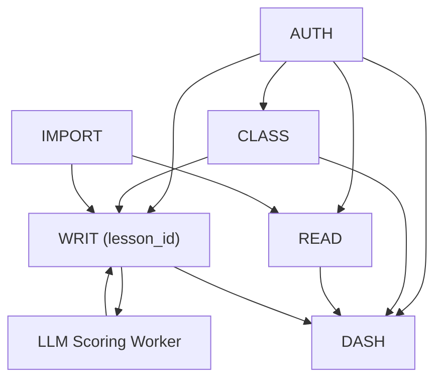

# Dependencies & Risks
## Dự án Langy — Pre-pilot MVP

> **Phiên bản:** 1.0
> **Ngày tạo:** 06/07/2026

---

## 1. External Dependencies

| ID | Dependency | Type | Impact nếu mất | Mitigation |
|----|-----------|------|-----------------|------------|
| DEP-001 | Google Gemini API | LLM scoring (primary) | AI chấm Writing dừng | Fallback sang OpenAI (DEP-002); bài vào ai_failed, GV chấm tay |
| DEP-002 | OpenAI API | LLM scoring (fallback) | Mất fallback | Chấp nhận — primary + fallback cùng down xác suất rất thấp |
| DEP-003 | PostgreSQL (managed) | Database | Toàn bộ hệ thống dừng | Backup hàng ngày; chọn provider SLA ≥99.9% |
| DEP-004 | Redis (managed) | Queue + rate limit | Chấm AI queue ngưng; rate limit vô hiệu | Chấp nhận downtime ngắn; queue recover khi Redis lên |
| DEP-005 | Email service | Quên mật khẩu, thông báo | Không gửi được email reset | Chấp nhận — GV liên hệ founder trực tiếp trong pilot |
| DEP-006 | Domain + SSL | Hosting | Không truy cập được | Chọn provider có auto-SSL |

## 2. Internal Dependencies (giữa các module)



| Dependency | Chi tiết |
|-----------|----------|
| WRIT phụ thuộc CLASS | Submission cần lesson_id → cần Classroom + Lesson trước |
| DASH phụ thuộc WRIT + READ | Dashboard cần data submission thật |
| IMPORT → READ/WRIT | Import tạo Passage/Prompt mà READ/WRIT sử dụng |
| SCORING phụ thuộc schema M1 | Worker cần state machine mới trước khi chạy đúng |

**Thứ tự build bắt buộc:** AUTH → M1 (schema) → CLASS → WRIT (core) → SCORING (worker update) → READ (responsive) → IMPORT → DASH → COMPLIANCE

---

## 3. Risk Register

### 3.1 Rủi ro CAO

| # | Rủi ro | Xác suất | Tác động | Mitigation | Owner |
|---|--------|----------|----------|------------|-------|
| R1 | **Dữ liệu cá nhân trẻ em** — phần lớn end user dưới 18; essay có thể chứa thông tin riêng tư; gửi qua API ngoài VN. Luật 91/2025 đã có hiệu lực | Trung bình | Cao | Checklist privacy BA Mục 13; consent flow; data minimization; paid tier; tham vấn luật sư trước thu phí | Founder |
| R2 | **Growth loop chưa tồn tại** — sau 5 đồng nghiệp không có kênh mở rộng | Cao | Cao | Deadline trả lời: tuần 6 pilot; thiết kế referral GV→GV trong sản phẩm | Founder |
| R3 | **Founder solo, ngoài giờ, không deadline rõ** — số giờ/tuần dao động 10–20; "không gì khiến tôi bỏ cuộc" | Trung bình | Cao | Pilot date 04/11 cố định; milestone 2 tuần/lần; descope-order nếu trễ | Founder |

### 3.2 Rủi ro TRUNG BÌNH

| # | Rủi ro | Xác suất | Tác động | Mitigation |
|---|--------|----------|----------|------------|
| R4 | **AI chấm lệch band** → mất niềm tin cả GV lẫn HS | Trung bình | Trung bình | Band AI = "ước lượng" (D3); lưu cặp calibration; test bộ essay chuẩn trước pilot; calibrated few-shot prompt (D9 Pha 1) |
| R5 | **Bản quyền nội dung** — kho đề seed có nguồn sưu tầm (bao gồm Cambridge) | Trung bình | Trung bình | ToS: GV cam kết quyền với nội dung upload; không seed đề Cambridge vào production; kho chính thức: tự viết/AI sinh + review |
| R6 | **Giá 50k chưa validate** — người trả (HS) không phải người chọn (GV) | Trung bình | Trung bình | Pilot đo giá trị riêng cho HS; khảo sát willingness-to-pay tuần 6–8 |
| R7 | **Desktop-only vs chuẩn thị trường mobile** — Azota đã dạy HS nộp bài trên điện thoại | Trung bình | Trung bình | Responsive mobile-web cho luồng HS trong MVP |
| R8 | **Nợ kỹ thuật ảnh hưởng pilot** — dashboard mock, endpoint thiếu, bug model tier, SDK EOL | Trung bình | Trung bình | Pre-pilot checklist; ưu tiên luồng GV/HS chạm trong pilot |
| R9 | **HS tự ôn dùng band AI là "điểm cuối"** — không có mạng lưới an toàn GV | Trung bình | Thấp–TB | Nhãn "ước lượng" + gợi ý tham gia lớp GV; ensemble (Pha 2) tăng tin cậy |
| R10 | **Import docx với đề thật** — định dạng mỗi GV một kiểu | Trung bình | Trung bình | Preview bắt buộc; mục tiêu ≥70% nhận diện đúng; fallback: GV sửa tay |

### 3.3 Rủi ro THẤP

| # | Rủi ro | Mitigation |
|---|--------|------------|
| R11 | LLM API tăng giá đột ngột | COGS hiện cực thấp (~120đ/bài); chuyển provider nếu cần |
| R12 | Tên "Langy" trùng thương hiệu | Kiểm tra trước khi thu phí chính thức |
| R13 | HS gian lận (essay do AI viết) | Ngoài scope pilot; xét thêm AI detection sau |

---

## 4. Assumptions (cần validate trong pilot)

| # | Giả định | Cách kiểm chứng | Deadline |
|---|----------|-----------------|----------|
| A1 | GV không biết code chịu đổi workflow sang Langy | 5 GV onboard không cần founder ngồi cạnh quá buổi đầu | Tuần 3 pilot |
| A2 | HS cảm nhận giá trị riêng | Tỷ lệ HS mở feedback AI; số HS tự làm bài ngoài giờ giao | Tuần 8 |
| A3 | HS/phụ huynh chịu trả 50k/tháng | Khảo sát tuần 6–8 + conversion thật khi bật thu phí | Tuần 8 |
| A4 | AI chấm đủ sát điểm GV | Độ lệch trung bình band AI vs band GV ≤ 0.5 | Tuần 8 |
| A5 | Import docx hoạt động với đề thật | Tỷ lệ import thành công ≥70% không cần sửa tay | Tuần 4 pilot |
| A6 | Network 5 GV đủ làm bàn đạp | ≥1 GV chủ động giới thiệu GV khác | Tuần 8 |
| A7 | HS tự ôn tìm đến organic | ≥30 đăng ký organic trong 8 tuần, ≥20% retention tuần 2 | Tuần 8 |
| A8 | HS tự ôn chấp nhận band AI là "điểm cuối" | Khảo sát trust tuần 6 | Tuần 6 |

---

## 5. Success / Kill Criteria (nhắc lại từ BA)

**GO:** ≥3/5 GV tự giao ≥1 bài/tuần ở tuần 7–8 mà không cần founder nhắc.

**NO-GO:** ≤1/5 GV còn giao bài ở tuần 8, HOẶC 0 HS tự quay lại làm bài ngoài giờ giao.

---

# ══════════════════════════════════════════════════════
# NỘI DUNG GỐC TỪ PRD BAN ĐẦU (02/2025)
# Giữ lại để tham chiếu. Khi mâu thuẫn, phần trên ưu tiên.
# ══════════════════════════════════════════════════════

# ⚠️ Dependencies & Risks — IELTS Helper (MVP)

> **Mã tài liệu:** PRD-13  
> **Phiên bản:** 1.2  
> **Ngày tạo:** 2025-02-21  
> **Ngày cập nhật:** 2026-04-14  
> **Trạng thái:** Revised  
> **Tham chiếu:** [12_technical_constraints](12_technical_constraints.md) | [07_non_functional_requirements](07_non_functional_requirements.md)

---

## 1. External Dependencies

### DEP-01 — LLM API Provider

| Attribute | Detail |
|-----------|--------|
| **Dependency** | OpenAI / Google Gemini / Anthropic API |
| **Usage** | Writing submission scoring (hybrid pipeline) |
| **Criticality** | **High** — writing scoring is unusable without LLM |
| **Required For** | FR-302, FR-303, WR-002 |
| **SLA Expected** | 99.5% uptime; <5s response for scoring prompts |
| **Fallback** | If primary provider fails → try secondary provider (configurable). If all fail → mark `processing_status=failed`, user can retry. |
| **Cost** | ~$0.002–0.005 per cheap call; ~$0.02–0.05 per premium call |
| **Action Items** | Configure `LLM_PROVIDER` + `LLM_FALLBACK_PROVIDER` env vars. Pre-provision API keys for at least 2 providers. |

---

### DEP-02 — DOCX/PDF Parser Stack (Mammoth primary + Gemini fallback)

| Attribute | Detail |
|-----------|--------|
| **Dependency** | **Primary:** `mammoth` + `sanitize-html` (npm). **Fallback:** Google Gemini Multimodal (`@google/generative-ai`) |
| **Usage** | Parse DOCX/PDF → HTML + structured IELTS questions (13 types). Mammoth xử lý DOCX semantic HTML + inline styles + tables. IELTS post-processor (in-house regex) detect paragraph labels, question groups, blanks. Gemini fallback khi confidence < 0.6, file PDF, hoặc Mammoth fail. |
| **Criticality** | **Medium** — manual content creation works without it. Mammoth standalone handles 80%+ cases; Gemini optional cho PDF và edge cases. |
| **Required For** | FR-601, FR-602, SY-001, SY-002, SY-003 |
| **SLA Expected** | Mammoth: local library, no SLA. Gemini: best-effort, no guarantee. |
| **Fallback** | Hierarchy: Mammoth → Gemini → manual CMS form. Tất cả Gemini calls retry 1 lần với prompt schema-only. |
| **Risk** | Mammoth: edge-case format breakage → fallback tự động. Gemini: pricing/drift/quota → feature flag `ENABLE_GEMINI_FALLBACK`. |
| **Cost** | Mammoth: $0. Gemini: ~$0.01–0.05 per fallback parse. |
| **Action Items** | Install `mammoth` + `sanitize-html`. Configure `GOOGLE_API_KEY` env var cho fallback. Cache parse result theo file hash TTL 24h (Redis). Rate limit 10 Gemini calls/user/hour. Monitor `parser_used` distribution. |

---

### DEP-03 — PostgreSQL Database

| Attribute | Detail |
|-----------|--------|
| **Dependency** | PostgreSQL 15+ |
| **Usage** | Primary data store for all entities |
| **Criticality** | **Critical** — application non-functional without DB |
| **Required For** | All FRs |
| **Provisioning** | Local install or Docker container (`docker compose up -d postgres`) |
| **Backup** | Docker volumes for dev; automated backups for prod (Phase 2) |
| **Action Items** | Include in `docker-compose.yml`. Seed script for initial data. |

---

### DEP-04 — Redis

| Attribute | Detail |
|-----------|--------|
| **Dependency** | Redis 7+ |
| **Usage** | Cache, rate limiting, BullMQ job queue |
| **Criticality** | **High** — writing scoring queue depends on Redis |
| **Required For** | WR-003 (rate limits), WR-004 (queue), SY-001 (cache) |
| **Fallback** | If Redis down → writing submissions fail (queue unavailable). Reading/Auth continue to work (DB-only). |
| **Provisioning** | Local install or Docker container |
| **Action Items** | Include in `docker-compose.yml`. Configure connection pooling. |

---

### DEP-05 — VS Code Dev Tunnels

| Attribute | Detail |
|-----------|--------|
| **Dependency** | VS Code Dev Tunnels / Port Forwarding |
| **Usage** | Sharing local dev environment for review |
| **Criticality** | **Low** — only needed for remote sharing |
| **Fallback** | ngrok, localtunnel, or direct LAN access |
| **Action Items** | Document setup in dev onboarding guide. |

---

## 2. Internal Dependencies

| Dependency | From | To | Description |
|-----------|------|-----|-------------|
| Auth middleware | All protected endpoints | Auth service | JWT validation + RBAC guard |
| Scoring worker | Writing submit | BullMQ + LLM | Async job processing |
| Grading service | Reading submit | Question data | MCQ/short answer comparison |
| Content status filter | Learner endpoints | Content tables | `WHERE status='published'` |
| Version logger | Admin mutations | content_versions table | Audit trail on every change |

---

## 3. Risk Register

### RISK-01 — Model Cost Overruns

| Attribute | Detail |
|-----------|--------|
| **ID** | RISK-01 |
| **Category** | Financial |
| **Probability** | Medium (3/5) |
| **Impact** | Medium (3/5) |
| **Risk Score** | 9/25 |
| **Description** | LLM API costs exceed budget if usage is higher than expected or if users abuse the system. |
| **Triggers** | High user volume, no rate limits, premium tier overuse |
| **Mitigation** | 1. Default to cheap tier. 2. Rate limit 5–10/day/user. 3. Token caps (600–900). 4. Usage logging + daily cost alerts. 5. Admin dashboard shows daily spend. |
| **Contingency** | Temporarily disable premium tier. Reduce daily limit. Switch to cheaper model. |
| **Owner** | Backend lead |
| **Status** | Mitigated by design |

---

### RISK-02 — Scoring Inconsistency

| Attribute | Detail |
|-----------|--------|
| **ID** | RISK-02 |
| **Category** | Quality |
| **Probability** | High (4/5) |
| **Impact** | High (4/5) |
| **Risk Score** | 16/25 |
| **Description** | LLM scoring produces inconsistent results across similar essays, or scores don't align with human IELTS benchmarks. |
| **Triggers** | Model randomness, poor prompt engineering, no calibration |
| **Mitigation** | 1. Detailed rubric in system prompt with IELTS band descriptors. 2. Temperature = 0.1–0.3 for consistency. 3. JSON schema enforcement. 4. Rule-based pre-checks (word count, structure). 5. Calibration set: 20–30 pre-scored essays for regression testing. |
| **Contingency** | Instructor manual override option. A/B test prompt variations. |
| **Owner** | AI/scoring lead |
| **Status** | Partially mitigated; calibration set needs creation |

---

### RISK-03 — Import Quality / Malformed Content

| Attribute | Detail |
|-----------|--------|
| **ID** | RISK-03 |
| **Category** | Data Quality |
| **Probability** | Medium (3/5) |
| **Impact** | Medium (3/5) |
| **Risk Score** | 9/25 |
| **Description** | Content parsed từ DOCX/PDF qua hybrid parser (Mammoth + Gemini) may be malformed, contain broken HTML, invalid question types, misdetected paragraph labels, hoặc inline blank placeholders lệch. |
| **Triggers** | Mammoth: unusual DOCX format (custom styles, embedded objects), corrupt files. Gemini fallback: model output drift, low-quality scanned PDFs. Post-processor: non-standard paragraph labeling, numbering conflicts. |
| **Mitigation** | 1. JSON schema validation cho parser output (SY-002). 2. Sanitize HTML qua `sanitize-html` (strip script/iframe/events). 3. Confidence score → auto-fallback Mammoth → Gemini khi <0.6. 4. Warnings[] array surface lên UI cho admin review. 5. Draft status by default (ADM-001). 6. Store SourceDocument với raw file for re-parse. |
| **Contingency** | Reject malformed imports với error chi tiết. Manual content creation fallback qua CMS forms. |
| **Owner** | Admin/content lead |
| **Status** | Mitigated by design |

---

### RISK-04 — Scoring Latency / Queue Backlog

| Attribute | Detail |
|-----------|--------|
| **ID** | RISK-04 |
| **Category** | Performance |
| **Probability** | Medium (3/5) |
| **Impact** | Medium (3/5) |
| **Risk Score** | 9/25 |
| **Description** | Writing scoring takes too long, queue jobs accumulate, SLA (<5 min) breached. |
| **Triggers** | LLM provider slow response, high concurrent submissions, low worker count |
| **Mitigation** | 1. Job timeout 90s. 2. Retry with backoff. 3. DLQ for stuck jobs. 4. Monitor queue depth + latency. 5. Alert when depth > 10 or avg latency > 3 min. |
| **Contingency** | Increase worker concurrency. Scale to separate worker process. |
| **Owner** | Backend lead |
| **Status** | Mitigated by design |

---

### RISK-05 — Data Loss in Local Dev

| Attribute | Detail |
|-----------|--------|
| **ID** | RISK-05 |
| **Category** | Infrastructure |
| **Probability** | Low (2/5) |
| **Impact** | Low (2/5) |
| **Risk Score** | 4/25 |
| **Description** | Local Postgres/Redis data lost due to container restart, crash, or developer error. |
| **Triggers** | `docker compose down -v`, disk failure, accidental deletion |
| **Mitigation** | 1. Docker named volumes (not anonymous). 2. Seed scripts for quick re-creation. 3. Git-track migration files. 4. Document backup/restore in dev guide. |
| **Contingency** | Re-run migrations + seed script. 2 min recovery. |
| **Owner** | DevOps / all devs |
| **Status** | Mitigated |

---

### RISK-06 — Provider API Breaking Changes

| Attribute | Detail |
|-----------|--------|
| **ID** | RISK-06 |
| **Category** | Technical |
| **Probability** | Low (2/5) |
| **Impact** | High (4/5) |
| **Risk Score** | 8/25 |
| **Description** | LLM provider changes API format, deprecates models, or increases pricing significantly. |
| **Triggers** | Provider announcements, SDK version changes |
| **Mitigation** | 1. Abstract LLM calls behind adapter pattern (strategy design). 2. Configure provider + model via env vars. 3. Support 2+ providers. 4. Pin SDK versions. |
| **Contingency** | Switch to alternative provider within 1 day. |
| **Owner** | Backend lead |
| **Status** | Mitigated by architecture |

---

## 4. Risk Matrix (Probability × Impact)

```
Impact →   1-Low    2        3-Med    4        5-High
Prob ↓
5-High                                RISK-02
4                                     
3-Med               RISK-05  RISK-01  
                              RISK-03  
                              RISK-04  
2-Low                        RISK-06  
1-Low                                 
```

---

## 5. Dependency Health Check Plan

| Dependency | Health Check | Frequency | Alert Threshold |
|-----------|-------------|-----------|-----------------|
| PostgreSQL | `SELECT 1` via pool | Every 30s | 3 consecutive failures |
| Redis | `PING` | Every 30s | 3 consecutive failures |
| LLM API | Test prompt (1 token) | Every 5 min | 2 consecutive failures |
| DOCX/PDF Parser | `parser_used` distribution + confidence avg | On each parse call | Alert nếu Gemini fallback rate > 30% hoặc avg confidence < 0.7 |
| BullMQ | Queue metrics | Every 30s | Depth > 20 or stale > 5 min |

---

> **Tham chiếu:** [07_non_functional_requirements](07_non_functional_requirements.md) | [12_technical_constraints](12_technical_constraints.md)

---

## Changelog
- v1.2 (2026-04-14): DEP-02 chuyển thành hybrid stack (Mammoth primary + Gemini fallback). RISK-03 cập nhật triggers cho cả 2 parsers + confidence-based fallback. Health check metric đổi thành `parser_used` distribution + confidence avg.
- v1.1 (2026-04-13): DEP-02 rewrite từ NotebookLM → Google Gemini Multimodal API. RISK-03 cập nhật triggers và mitigation cho DOCX/PDF parsing. Health check bảng thay NotebookLM row.
