# 🔄 Sequence Diagrams — IELTS Helper (MVP)

> **Mã tài liệu:** PRD-15  
> **Phiên bản:** 1.2  
> **Ngày tạo:** 2025-02-21  
> **Cập nhật:** 2026-04-14  
> **Trạng thái:** Draft  
> **Tham chiếu:** [05_functional_requirements](05_functional_requirements.md) | [09_api_specifications](09_api_specifications.md)
>
> **Changelog:**
> - v1.2 (2026-04-14): SD-07 chuyển sang hybrid parser flow: hash-based Redis cache → Mammoth primary + IELTS post-processor → Gemini fallback khi confidence < 0.6 hoặc PDF. Lưu `parser_used`, `confidence`, `warnings`.
> - v1.1 (2026-04-14): Rewrite SD-07 từ NotebookLM URL fetch → DOCX/PDF upload qua Gemini Multimodal (multipart, parse JSON, sanitize HTML, create draft passage + questions).

---

## SD-01: User Registration

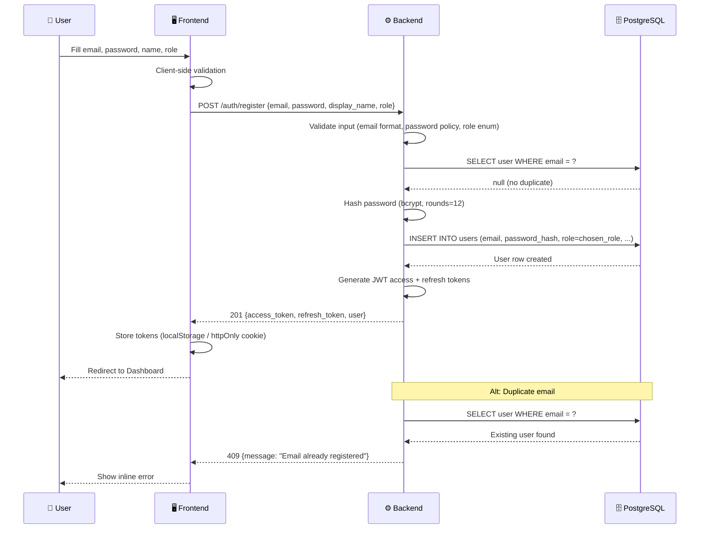

---

## SD-02: User Login

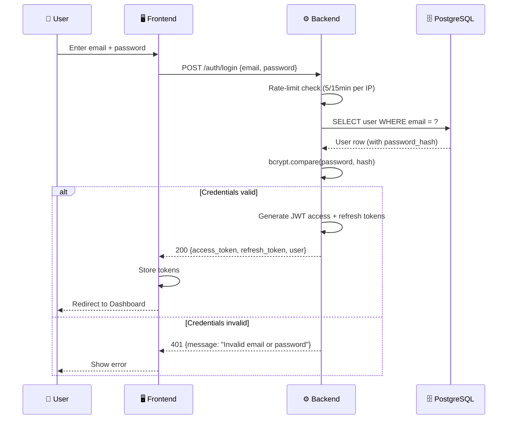

---

## SD-03: Token Refresh

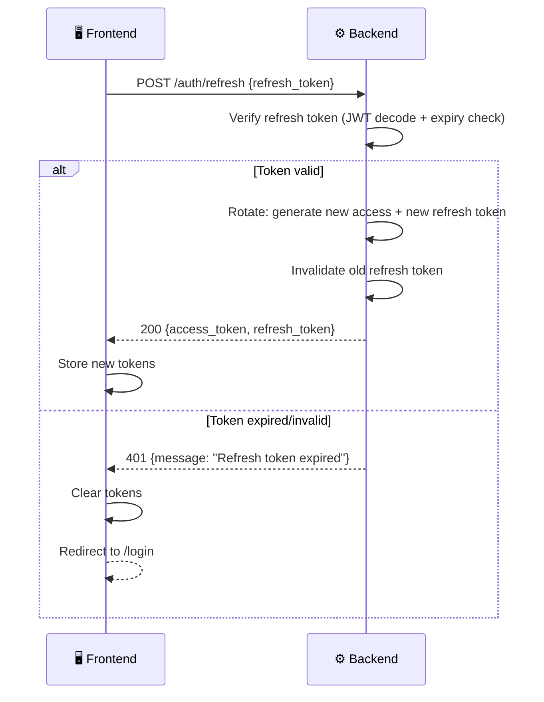

---

## SD-04: Reading Practice (Browse → Submit → Result)

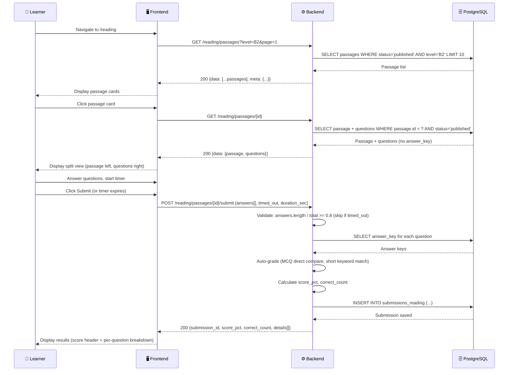

---

## SD-05: Writing Submit — Async Scoring Pipeline

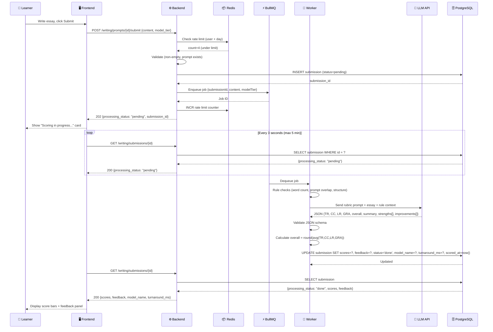

---

## SD-06: Writing Scoring Failure & Retry

```mermaid
sequenceDiagram
    participant Q as ⚡ BullMQ
    participant W as 🔧 Worker
    participant LLM as 🤖 LLM API
    participant DB as 🗄️ PostgreSQL
    participant DLQ as 💀 Dead Letter Queue

    Q->>W: Dequeue job (attempt 1)
    W->>LLM: Send scoring prompt
    LLM-->>W: ❌ Timeout (60s)
    W->>W: Log error; trigger retry

    Q->>W: Retry (attempt 2, after 1s backoff)
    W->>LLM: Send scoring prompt
    LLM-->>W: ❌ Invalid JSON response
    W->>W: Log error; trigger retry

    Q->>W: Retry (attempt 3, after 2s backoff)
    W->>LLM: Send scoring prompt
    LLM-->>W: ❌ 500 Server Error
    W->>W: Max retries exhausted

    W->>DB: UPDATE submission SET status='failed', error_message='Scoring service unavailable after 3 attempts'
    W->>DLQ: Move job to Dead Letter Queue
    
    Note over DLQ: Admin reviews failed jobs via /admin/queues
```

---

## SD-07: Admin DOCX/PDF Import via Hybrid Parser (Mammoth primary + Gemini fallback)

```mermaid
sequenceDiagram
    participant A as 🔧 Admin
    participant FE as 🖥️ Frontend
    participant BE as ⚙️ Backend
    participant MM as 📘 Mammoth + IELTS PostProc
    participant RD as 📦 Redis Cache
    participant GEM as 📄 Gemini Multimodal
    participant DB as 🗄️ PostgreSQL

    A->>FE: Click "Upload DOCX/PDF"
    FE->>FE: Show import modal (file picker, title, tags, level)
    A->>FE: Choose .docx/.pdf file, click Parse
    FE->>BE: POST /reading/parse-docx (multipart: file, metadata)
    BE->>BE: Validate file type (.docx/.pdf) + size (≤10MB)

    alt Invalid
        BE-->>FE: 400/413 error
        FE-->>A: Show error
    else Valid
        BE->>BE: Compute SHA-256 hash of file
        BE->>RD: GET parse:{hash}
        alt Cache hit
            RD-->>BE: Cached parse result
        else Cache miss
            alt File is DOCX
                BE->>MM: mammoth.convertToHtml(buffer) + IELTS post-process
                MM-->>BE: {body_html, paragraphs, questions, confidence, warnings}
                alt confidence ≥ 0.6
                    Note over BE: parser_used = "mammoth"
                else confidence < 0.6
                    BE->>GEM: uploadFile + generateContent(IELTS prompt, file)
                    GEM-->>BE: Normalized JSON (same schema)
                    Note over BE: parser_used = "gemini"
                end
            else File is PDF
                BE->>GEM: uploadFile + generateContent(IELTS prompt, file)
                GEM-->>BE: Normalized JSON
                Note over BE: parser_used = "gemini"
            end
            BE->>BE: sanitize-html(body_html); validate schema; check blank_refs
            BE->>RD: SET parse:{hash} TTL=24h
        end

        BE->>DB: INSERT source_documents (filename, mime, uploaded_by, parser_used, confidence, parse_status='done')
        DB-->>BE: source_document_id
        BE->>DB: INSERT passages (title, body_html, level, status='draft', source_document_id)
        BE->>DB: INSERT questions (passage_id, type, stem, options, correct_answer, group_id, blank_refs)
        DB-->>BE: passage_id + question_ids
        BE-->>FE: 200 {source_document_id, parser_used, confidence, warnings, passage, questions}
        FE-->>A: Preview panel: passage (full split-view) + questions + warnings banner
    end

    A->>FE: Review, click "Save as Draft"
    FE->>BE: PATCH /admin/content/passages/{id} (edits)
    BE->>DB: UPDATE passage, questions
    BE-->>FE: 200 {updated}
    FE-->>A: "Draft saved" toast
```

---

## SD-08: Admin Publish Content

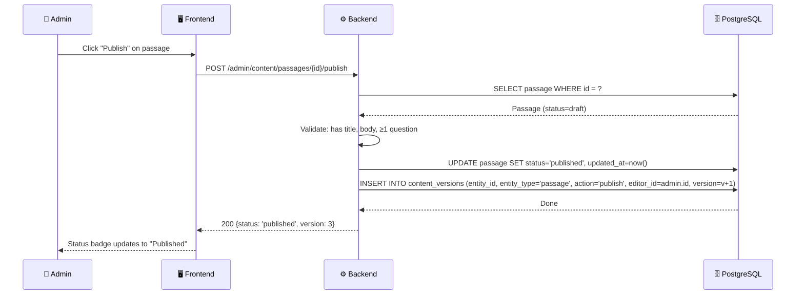

---

> **Tham chiếu:** [05_functional_requirements](05_functional_requirements.md) | [09_api_specifications](09_api_specifications.md) | [11_business_rules](11_business_rules.md)

---

# ══════════════════════════════════════════════════════
# BỔ SUNG TỪ BUSINESS ANALYSIS & REDESIGN (07/2026)
# Các mục dưới đây bổ sung từ BA 6 vòng elicitation,
# phân tích đối thủ, và thiết kế state machine mới.
# Khi có mâu thuẫn với nội dung trên, phần này được ưu tiên.
# ══════════════════════════════════════════════════════

# Sequence Diagrams
## Dự án Langy

> **Phiên bản:** 1.0
> **Ngày tạo:** 06/07/2026

---

## 1. Writing Submission — Chế độ A (instant)

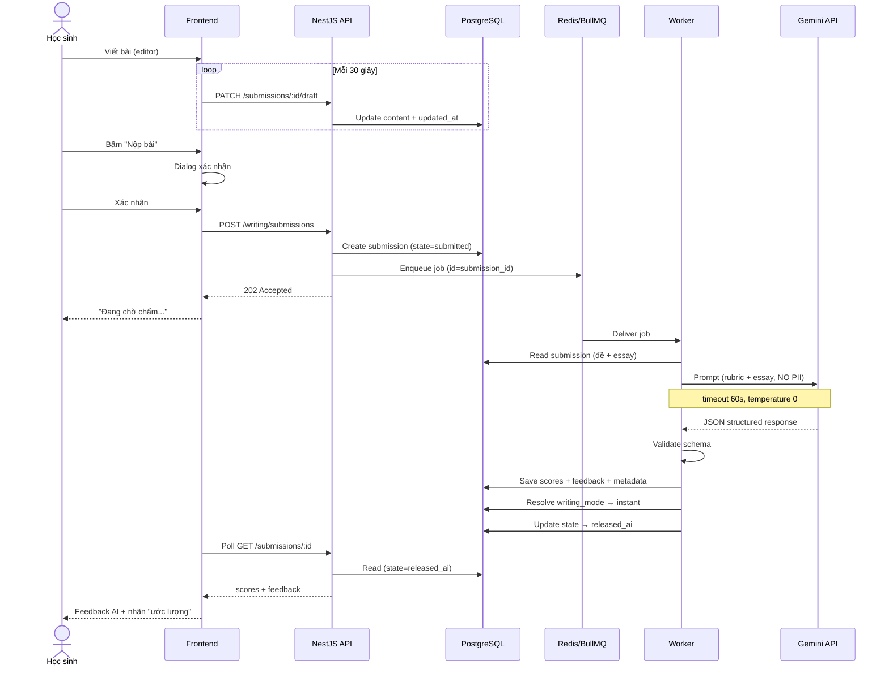

---

## 2. Writing Submission — Chế độ B (review_first)

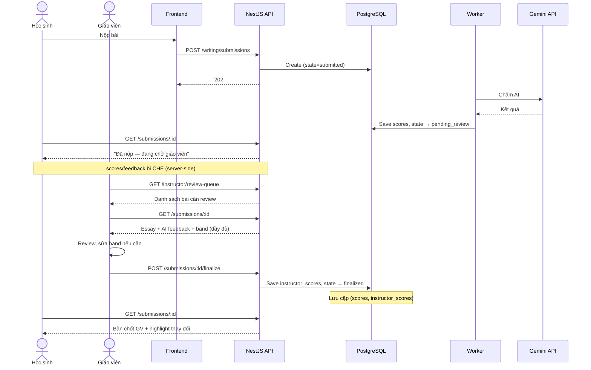

---

## 3. AI Scoring — Error Flow

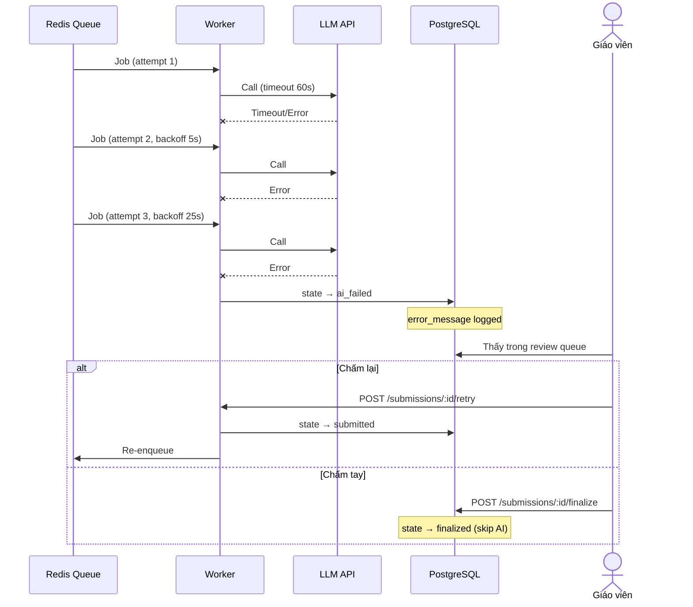

---

## 4. Classroom — Tạo lớp + HS tham gia

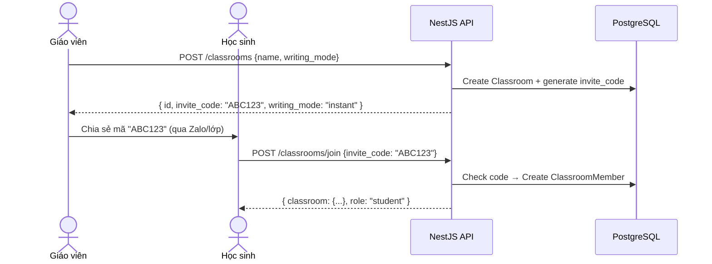

---

## 5. Import Reading từ docx

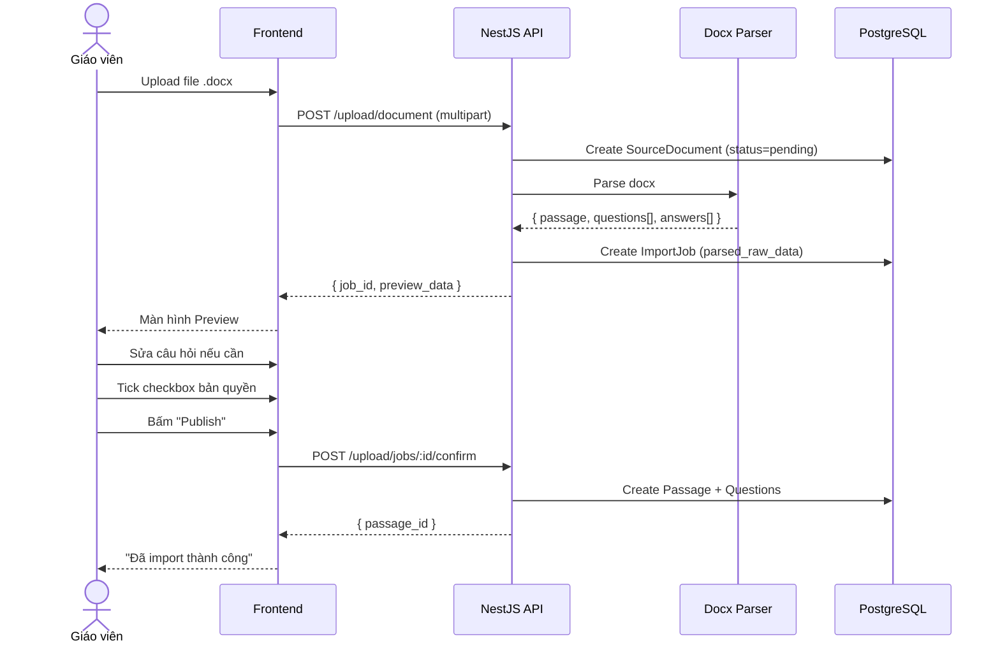

---

## 6. Đăng ký — HS dưới 16 tuổi

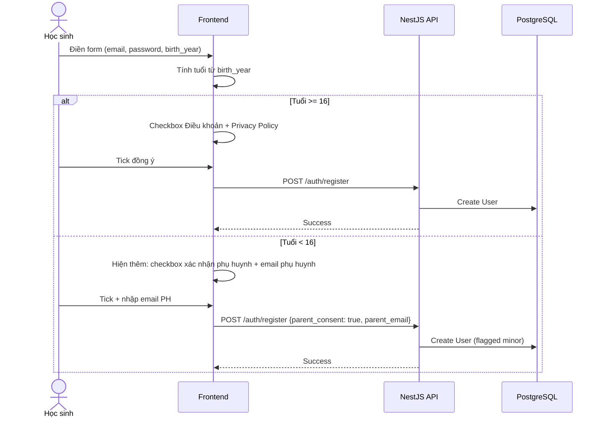
