# 🔀 Activity Diagrams — IELTS Helper (MVP)

> **Mã tài liệu:** PRD-16  
> **Phiên bản:** 1.2  
> **Ngày tạo:** 2025-02-21  
> **Cập nhật:** 2026-04-14  
> **Trạng thái:** Draft  
> **Tham chiếu:** [04_user_stories](04_user_stories.md) | [14_usecase_diagram](14_usecase_diagram.md)
>
> **Changelog:**
> - v1.2 (2026-04-14): AD-05 cập nhật hybrid flow: Redis cache → Mammoth primary + IELTS post-processor → confidence gate → Gemini fallback. Thêm nhánh PDF tự động vào Gemini. Preview panel có warnings banner.
> - v1.1 (2026-04-14): Rewrite AD-05 thành DOCX/PDF Import Flow (file validation → Gemini parse → HTML sanitize → schema validate → draft passage + questions).

---

## AD-01: Reading Practice Flow (Learner)

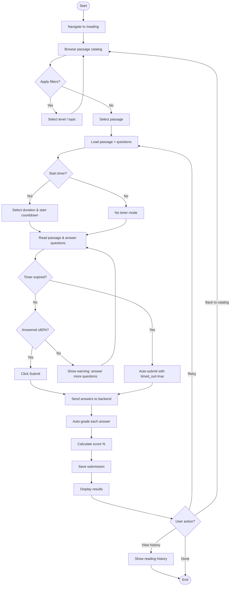

---

## AD-02: Writing Practice Flow (Learner)

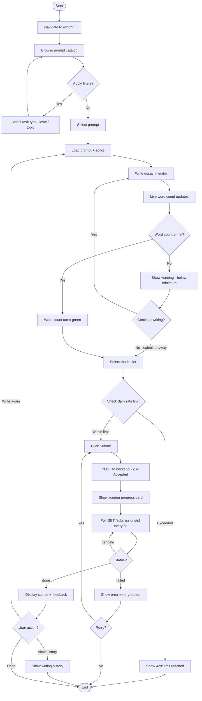

---

## AD-03: Writing Scoring Pipeline (System)

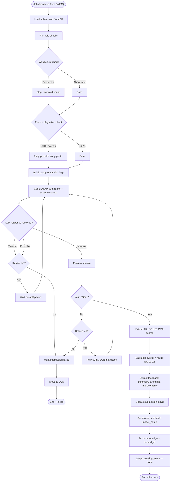

---

## AD-04: Admin Content Publishing Flow

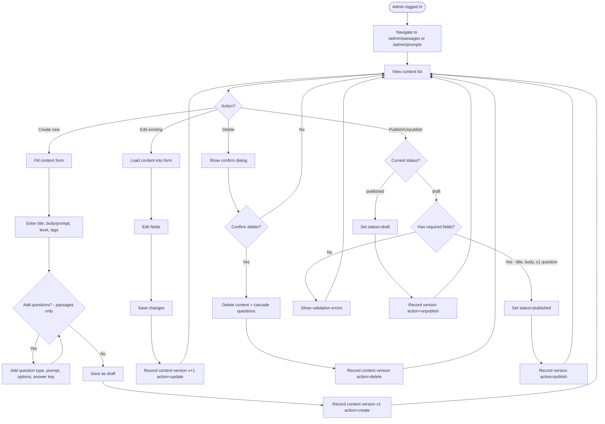

---

## AD-05: DOCX/PDF Import Flow (Hybrid Mammoth + Gemini Fallback)

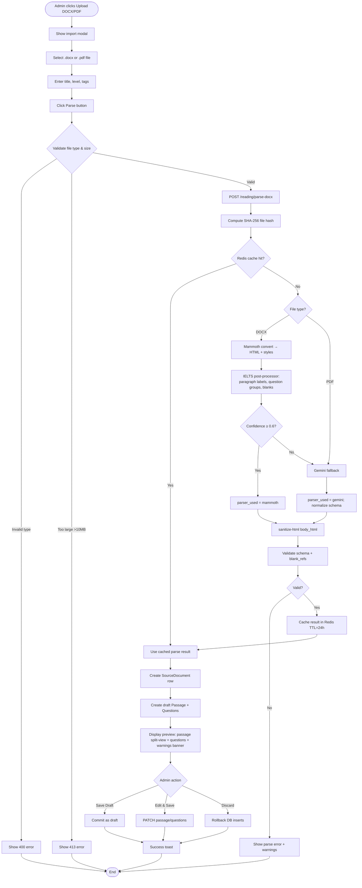

---

## AD-06: Authentication Flow

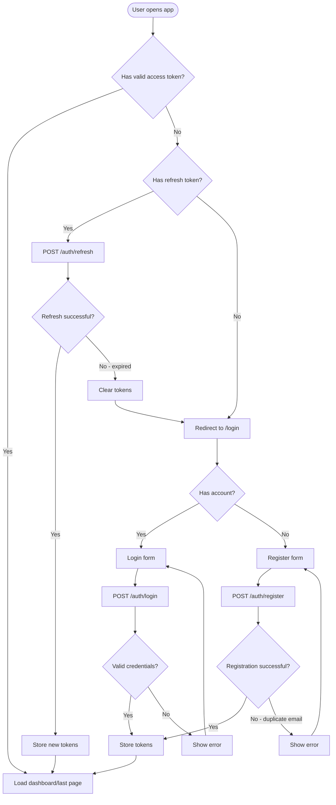

---

## AD-07: Dashboard View Flow

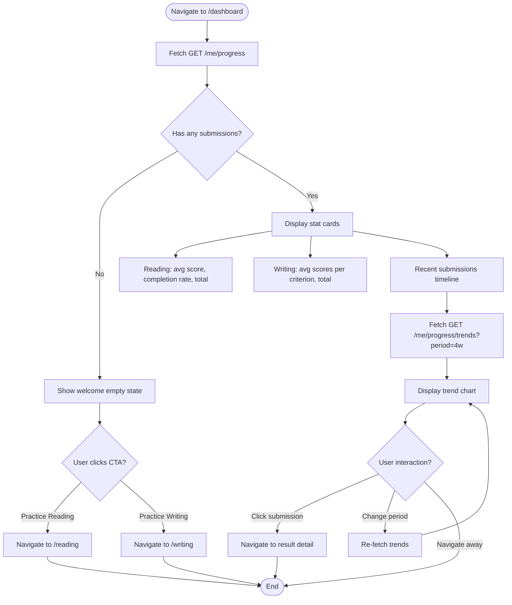

---

> **Tham chiếu:** [04_user_stories](04_user_stories.md) | [14_usecase_diagram](14_usecase_diagram.md) | [15_sequence_diagrams](15_sequence_diagrams.md)

---

# ══════════════════════════════════════════════════════
# BỔ SUNG TỪ BUSINESS ANALYSIS & REDESIGN (07/2026)
# Các mục dưới đây bổ sung từ BA 6 vòng elicitation,
# phân tích đối thủ, và thiết kế state machine mới.
# Khi có mâu thuẫn với nội dung trên, phần này được ưu tiên.
# ══════════════════════════════════════════════════════

# Activity Diagrams
## Dự án Langy

> **Phiên bản:** 1.0
> **Ngày tạo:** 06/07/2026

---

## 1. Writing Submission — State Machine

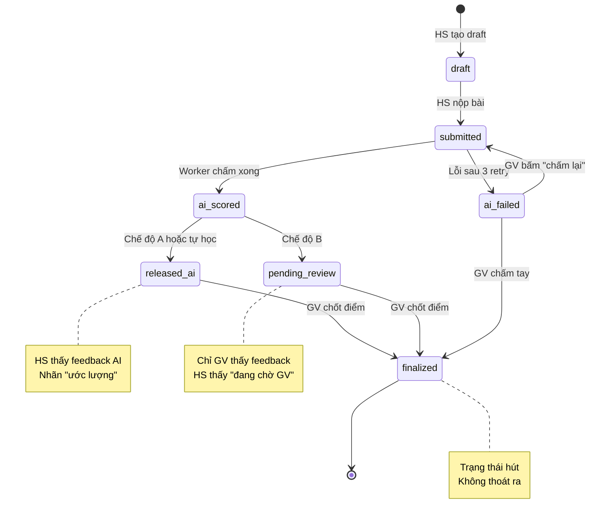

### Bất biến (invariants):
1. Bài tự học (lesson_id = null) KHÔNG BAO GIỜ vào pending_review hoặc finalized
2. Đổi writing_mode của lớp KHÔNG đổi state của submission cũ
3. finalized là trạng thái hút — không có transition ra

---

## 2. Luồng tổng thể — GV giao bài đến HS nhận feedback

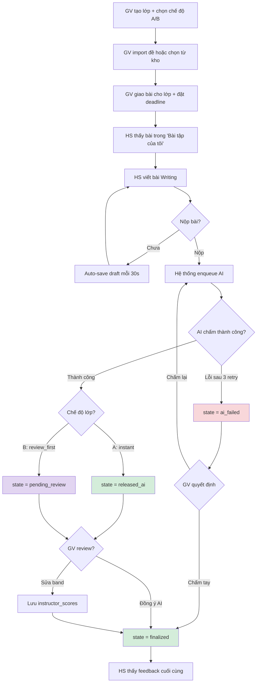

---

## 3. Luồng HS tự ôn (self-study)

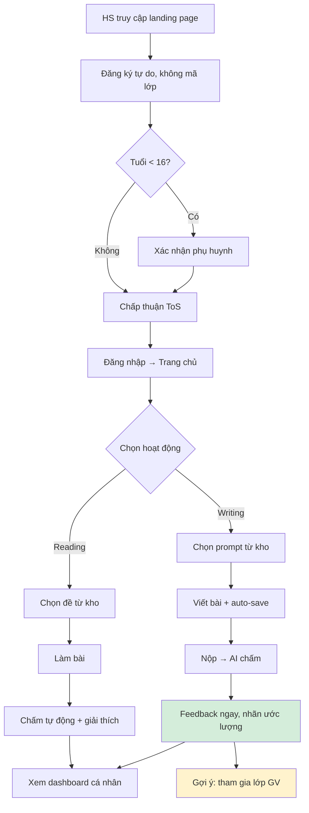

---

## 4. Import đề Reading

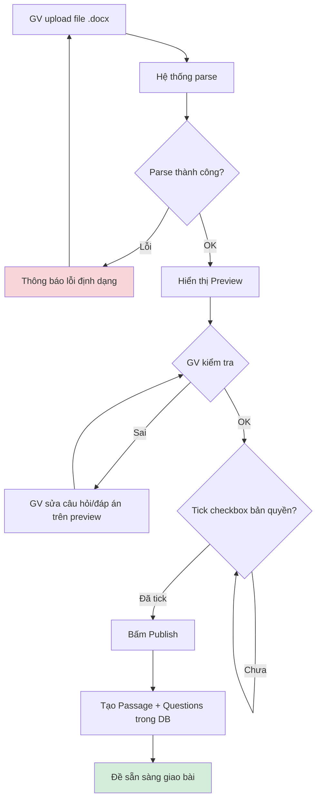

---

## 5. Xóa tài khoản

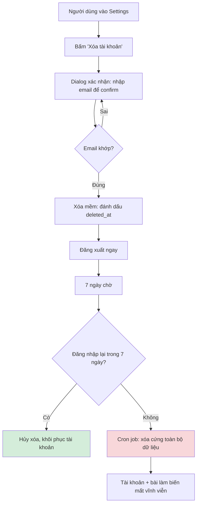
