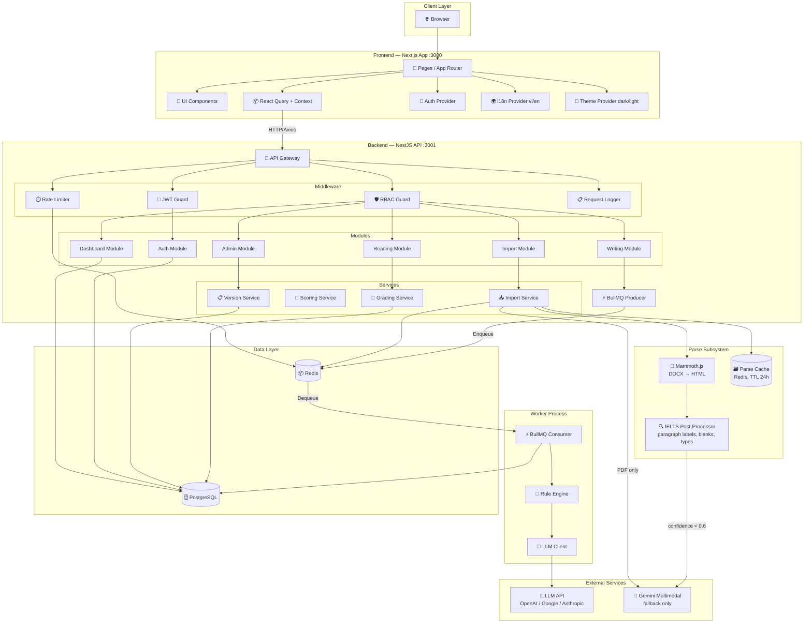
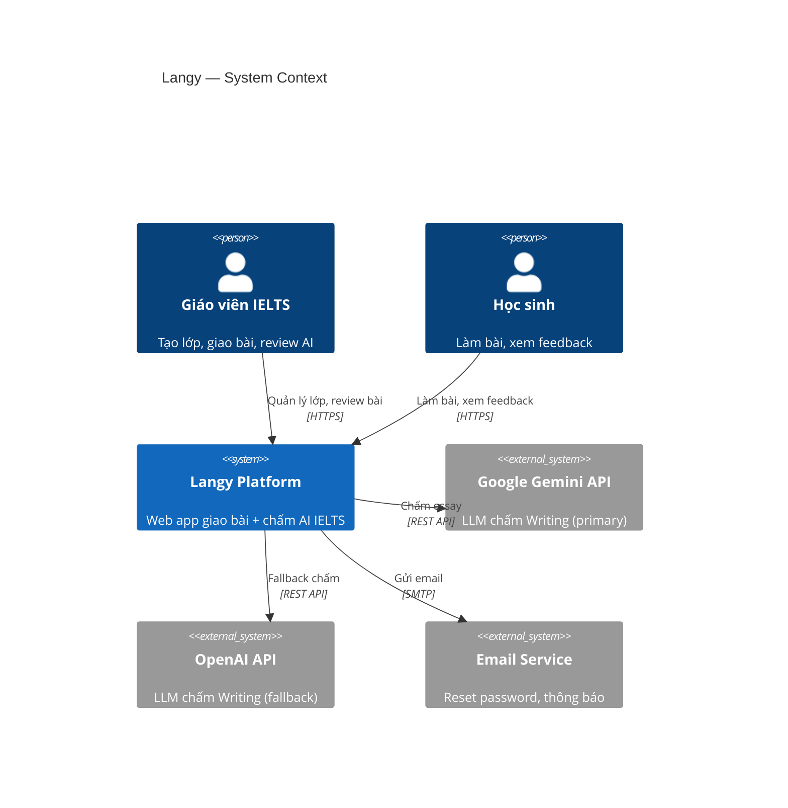
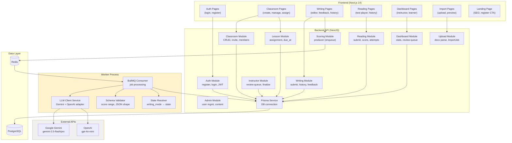
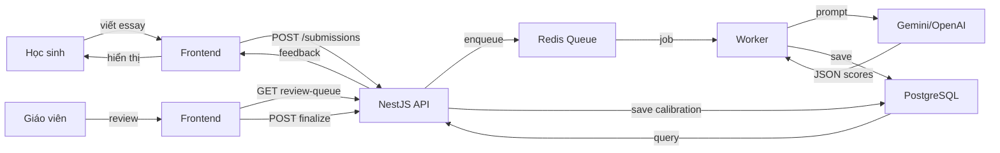

# 🏗️ Component Diagram — IELTS Helper (MVP)

> **Mã tài liệu:** PRD-17  
> **Phiên bản:** 1.2  
> **Ngày tạo:** 2025-02-21  
> **Cập nhật:** 2026-04-14  
> **Trạng thái:** Draft  
> **Tham chiếu:** [12_technical_constraints](12_technical_constraints.md) | [15_sequence_diagrams](15_sequence_diagrams.md)
>
> **Changelog:**
> - v1.2 (2026-04-14): Thêm "Parse Subsystem" subgraph (Mammoth + IELTS Post-Processor + Parse Cache). Gemini hạ xuống fallback-only. Dataflow Import cập nhật. External services table thêm Mammoth primary.
> - v1.1 (2026-04-14): External Services node NLM → Gemini Multimodal. Dataflow "Import source" → "Import DOCX/PDF". External services table cập nhật.

---

## 1. System Architecture Overview



---

## 2. Frontend Component Breakdown

```mermaid
graph TB
    subgraph "App Shell"
        Layout[RootLayout]
        Nav[Sidebar / BottomNav]
        Header[Header - logo, user menu, toggles]
    end

    subgraph "Auth Pages"
        LoginPage[/login]
        RegisterPage[/register]
    end

    subgraph "Reading Pages"
        ReadingList[/reading - Catalog]
        ReadingDetail[/reading/:id - Practice]
        ReadingResult[/reading/:id/result/:subId]
        ReadingHistory[/reading/history]
    end

    subgraph "Writing Pages"
        WritingList[/writing - Catalog]
        WritingEditor[/writing/:id - Editor]
        WritingFeedback[/writing/submissions/:id]
        WritingHistory[/writing/history]
    end

    subgraph "Dashboard Pages"
        DashboardMain[/dashboard]
    end

    subgraph "Admin Pages"
        AdminPassages[/admin/passages]
        AdminPassageForm[/admin/passages/new or :id]
        AdminPrompts[/admin/prompts]
        AdminPromptForm[/admin/prompts/new or :id]
        AdminSources[/admin/sources]
        AdminUsers[/admin/users]
    end

    subgraph "Shared Components"
        FilterBar[FilterBar - level, topic, search]
        PaginationC[Pagination]
        ScoreBar[ScoreBar - 0–9 with fill]
        Timer[Timer - countdown]
        WordCounter[WordCounter]
        Card[ContentCard]
        Badge[StatusBadge / LevelBadge]
        Modal[Modal - confirm, import]
        Toast[Toast - notifications]
        Skeleton[Skeleton - loading]
        EmptyState[EmptyState]
    end

    Layout --> Nav
    Layout --> Header
    ReadingList --> FilterBar
    ReadingList --> Card
    ReadingList --> PaginationC
    ReadingDetail --> Timer
    WritingEditor --> WordCounter
    WritingFeedback --> ScoreBar
    AdminPassages --> Modal
```

---

## 3. Backend Module Breakdown

```mermaid
graph TB
    subgraph "Auth Module"
        AuthController[AuthController]
        AuthService[AuthService]
        JwtStrategy[JwtStrategy]
        RolesGuard[RolesGuard]
    end

    subgraph "Reading Module"
        ReadingController[ReadingController]
        ReadingService[ReadingService]
        GradingService[GradingService]
    end

    subgraph "Writing Module"
        WritingController[WritingController]
        WritingService[WritingService]
        ScoringProducer[ScoringProducer - BullMQ]
    end

    subgraph "Scoring Worker - separate process"
        ScoringConsumer[ScoringConsumer]
        RuleEngine[RuleEngine]
        LLMClient[LLMClient]
        LLMAdapter[LLMAdapter - strategy pattern]
    end

    subgraph "Dashboard Module"
        DashboardController[DashboardController]
        ProgressService[ProgressService]
    end

    subgraph "Admin Module"
        AdminController[AdminController]
        ContentService[ContentService]
        VersionService[VersionService]
    end

    subgraph "Import Module"
        ImportController[ImportController]
        ImportService[ImportService]
        SanitizeUtil[SanitizeUtil]
    end

    subgraph "Shared"
        DB_Module[DatabaseModule - Prisma]
        Redis_Module[RedisModule]
        Config_Module[ConfigModule - env vars]
        Logger_Module[LoggerModule - Pino]
    end

    AuthController --> AuthService
    AuthService --> JwtStrategy
    ReadingController --> ReadingService
    ReadingService --> GradingService
    WritingController --> WritingService
    WritingService --> ScoringProducer
    ScoringConsumer --> RuleEngine
    ScoringConsumer --> LLMClient
    LLMClient --> LLMAdapter
    DashboardController --> ProgressService
    AdminController --> ContentService
    AdminController --> VersionService
    ImportController --> ImportService
    ImportService --> SanitizeUtil
```



---

## 4. Data Flow Summary

| Flow | Source | Destination | Protocol | Data |
|------|--------|-------------|----------|------|
| Browse content | FE | BE → PG | HTTP GET | Passage/prompt lists |
| Submit reading | FE | BE → PG | HTTP POST | Answers → score (sync) |
| Submit writing | FE | BE → Redis → Worker → PG | HTTP POST + Queue | Essay → scores (async) |
| Poll status | FE | BE → PG | HTTP GET | Submission status |
| Admin CRUD | FE | BE → PG | HTTP POST/PATCH/DELETE | Content mutations |
| Import DOCX/PDF | FE | BE → Mammoth + IELTS PostProc → (fallback Gemini) → PG | HTTP POST (multipart) | File → passage_html + paragraphs + questions JSON |
| LLM scoring | Worker | LLM API | HTTPS | Rubric prompt → JSON scores |
| Rate limiting | BE | Redis | Redis commands | INCR/GET counters |
| Caching | BE | Redis | Redis commands | GET/SET with TTL |

---

## 5. Deployment Architecture (Local Dev)

```
┌─────────────────────────────────────────────────┐
│                 Developer Machine                │
│                                                  │
│  ┌──────────────┐    ┌──────────────┐           │
│  │  Next.js FE  │    │  NestJS BE   │           │
│  │   :3000      │───►│   :3001      │           │
│  └──────────────┘    └──────┬───────┘           │
│                             │                    │
│         ┌───────────────────┼───────────────┐   │
│         │                   │               │   │
│         ▼                   ▼               │   │
│  ┌────────────┐     ┌────────────┐          │   │
│  │ PostgreSQL  │     │   Redis    │          │   │
│  │  :5432      │     │   :6379    │          │   │
│  │ (Docker)    │     │  (Docker)  │          │   │
│  └────────────┘     └────────────┘          │   │
│                                              │   │
│  ┌─────────────────────────┐                │   │
│  │  BullMQ Worker Process  │────────────────┘   │
│  │  (same or separate)     │                    │
│  └─────────────────────────┘                    │
│                                                  │
│  ┌──────────────────────────────────────┐       │
│  │  VS Code Dev Tunnel (for sharing)    │       │
│  │  https://<id>.devtunnels.ms          │       │
│  └──────────────────────────────────────┘       │
└─────────────────────────────────────────────────┘
                    │
                    ▼
        ┌────────────────────┐
        │  External APIs     │
        │  - OpenAI/Google   │
        │  - Gemini Multimodal│
        └────────────────────┘
```

---

## 6. Technology Stack Map

| Component | Technology | Port | Container |
|-----------|-----------|------|-----------|
| Frontend | Next.js 14 + React 18 + TypeScript | 3000 | No (native) |
| Backend API | NestJS 10 + TypeScript | 3001 | No (native) |
| Worker | NestJS (standalone or same process) | — | No |
| Database | PostgreSQL 15 | 5432 | Yes (Docker) |
| Cache/Queue | Redis 7 | 6379 | Yes (Docker) |
| LLM | OpenAI / Google / Anthropic SDK | — | External API |
| DOCX/PDF Parser (Primary) | Mammoth.js + sanitize-html (npm libs) | — | Local library |
| DOCX/PDF Parser (Fallback) | Google Gemini Multimodal API | — | External API |

---

> **Tham chiếu:** [12_technical_constraints](12_technical_constraints.md) | [09_api_specifications](09_api_specifications.md) | [08_data_requirements](08_data_requirements.md)

---

# ══════════════════════════════════════════════════════
# BỔ SUNG TỪ BUSINESS ANALYSIS & REDESIGN (07/2026)
# Các mục dưới đây bổ sung từ BA 6 vòng elicitation,
# phân tích đối thủ, và thiết kế state machine mới.
# Khi có mâu thuẫn với nội dung trên, phần này được ưu tiên.
# ══════════════════════════════════════════════════════

# Component Diagram
## Dự án Langy

> **Phiên bản:** 1.0
> **Ngày tạo:** 06/07/2026

---

## 1. System Architecture



---

## 2. Backend Component Diagram



---

## 3. NestJS Module Structure (hiện có trong repo)

```
apps/backend/src/
├── main.ts                    # Bootstrap
├── app.module.ts              # Root module
├── prisma/                    # Prisma service + schema
├── auth/                      # JWT auth, register, login
├── admin/                     # Admin CRUD (users, content)
├── classroom/                 # Classroom + members + invite
├── lesson/                    # Lesson CRUD + assignment
├── writing/                   # Writing submissions + prompts
├── reading/                   # Reading passages + submissions
├── scoring/                   # BullMQ producer + consumer
│   ├── scoring.producer.ts    #   Enqueue job
│   ├── scoring.consumer.ts    #   Process job
│   ├── llm-client.service.ts  #   Gemini/OpenAI adapter
│   ├── rubric.prompt.ts       #   Prompt template
│   └── schema-validator.ts    #   Output validation
├── instructor/                # Review queue, finalize
├── dashboard/                 # Stats endpoints
├── topic/                     # Topic management
├── upload/                    # Docx import pipeline
├── notification/              # Notification service
└── seeds/                     # Seed data scripts
```

---

## 4. Frontend Route Structure

```
apps/frontend/src/app/
├── page.tsx                   # Landing page (HS tự ôn)
├── login/                     # Auth
├── register/                  # Auth + consent
├── settings/                  # Profile + delete account
├── reading/
│   ├── page.tsx               # Reading list (kho đề)
│   ├── [id]/                  # Test player
│   └── attempts/[id]/         # Xem lại bài cũ
├── writing/
│   ├── page.tsx               # Writing list (kho đề)
│   ├── [id]/                  # Editor + submit
│   └── history/               # Lịch sử
├── classrooms/
│   ├── page.tsx               # Danh sách lớp (GV)
│   └── [id]/                  # Chi tiết lớp + members
├── instructor/
│   ├── page.tsx               # Review queue
│   └── dashboard/             # Dashboard GV
└── dashboard/                 # Dashboard HS cá nhân
```

---

## 5. Data Flow Summary


