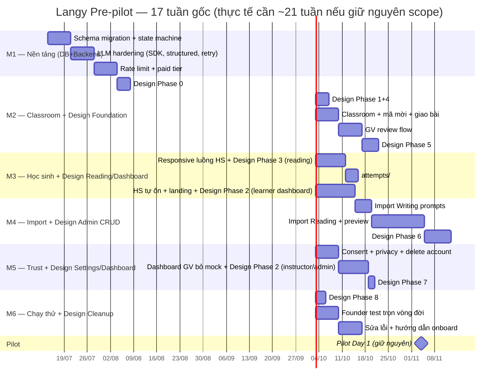

# Implementation Plan
## Dự án Langy — Pre-pilot MVP

> **Phiên bản:** 1.1 — thêm nhãn Layer (DB/Backend/Frontend/Infra) + merge Design System plan (`docs/superpowers/plans/2026-08-01-tokens-css-adoption.md`)
> **Ngày tạo:** 06/07/2026 · **Cập nhật:** 01/08/2026
> **Nguồn lực:** 1 developer (founder), 10–20h/tuần
> **Deadline:** Pilot Day 1 — 04/11/2026 (17 tuần từ giữa 07/2026)

---

## ⚠️ Cảnh báo capacity (đọc trước khi dùng plan này)

Merge design-system plan vào cộng thêm **~176h** việc thuần restyle (9 phase, ~25 task trên ~27 trang) vào **240h** việc feature gốc (M1–M6) = **~416h**. Capacity 17 tuần × 10–20h/tuần = **170–340h**. Ngay cả ở mức cao nhất (20h/tuần), plan gộp đang **vượt capacity ~76h (~4 tuần)**.

Ba lựa chọn, không tự chọn thay bạn:
1. **Giãn deadline pilot** ~3–4 tuần.
2. **Cắt bớt design-system scope** — chỉ làm Phase 0 (foundation) + các trang HS thấy nhiều nhất (auth, dashboard, reading, writing); bỏ hoặc làm tối giản Phase 6 (12 trang CRUD admin/instructor — GV/admin ít khi vào, giá trị thấp/giờ nhiều).
3. **Chấp nhận rủi ro trễ**, chạy hết cả hai, review lại ở cuối M2 xem thực tế burn-rate có khớp không.

Plan dưới đây **gộp nguyên trạng cả hai** (chưa cắt gì) — số giờ mỗi milestone đã cộng thêm phần design. Bạn cần quyết 1 trong 3 hướng trên trước khi bắt tay M2 trở đi.

---

## 1. Timeline tổng quan (đã cộng effort design-system, CHƯA giãn deadline)

---

## 2. Chi tiết từng Milestone

**Nhãn Layer:** `[DB]` = Prisma schema/migration · `[Backend]` = NestJS API/service/worker · `[Frontend]` = Next.js page/component logic · `[Design]` = restyle thuần theo `tokens-css-adoption.md`, không đổi logic · `[Infra]` = Redis/BullMQ/env/cron.

### M1 — Nền tảng tin cậy (tuần 1–3, ~45h) — DB + Backend, không đụng Frontend

| Task | Layer | Effort | Deliverable | Acceptance |
|------|-------|--------|-------------|------------|
| Schema migration: enums SubmissionState + WritingMode, cột mới, index | `[DB]` | 6h | Prisma migration file + backfill script | Backfill idempotent, unit tests pass |
| State machine service: bảng chuyển trạng thái + 3 bất biến | `[Backend]` | 8h | `submission-state.service.ts` | 10 unit tests (mỗi hàng bảng + bất biến) |
| Migrate SDK `@google/genai` | `[Backend]` | 3h | `llm-client.service.ts` updated | Existing scoring tests pass |
| Structured output mode (Gemini + OpenAI) | `[Backend]` | 4h | Xóa regex parse | Integration test: valid JSON |
| Temperature 0 + prompt_version + token logging | `[Backend]`/`[DB]` | 2h | Config + schema fields | Token usage logged per submission |
| Timeout + retry + idempotency (BullMQ config) | `[Backend]`/`[Infra]` | 3h | Worker config | Retry test: 3 attempts + ai_failed |
| Sửa bug tier (2 tier trùng) + paid tier | `[Backend]` | 1h | Env config | Startup check: paid key valid |
| Rate limit Writing submit (Redis) | `[Backend]`/`[Infra]` | 3h | Middleware | Test: 11th submission → 429 |

**M1 total: 30h** *(bảng gốc ghi tổng 45h nhưng cộng dồn cột Effort chỉ ra 30h — chênh lệch có sẵn từ bản v1.0, chưa rõ nguồn, ghi chú lại chứ không tự sửa số).*

### M2 — Vòng đời lớp học + Design Foundation (tuần 4–6 gốc, thực tế cần dài hơn)

| Task | Layer | Effort | Deliverable |
|------|-------|--------|-------------|
| **[Design Phase 0]** Fix 2 bug CSS chết + import token/biến `tokens.css` + dựng lại AppShell (sidebar/topbar) | `[Design]` | 22h | `globals.css` mới, shell component mới — **phải xong trước mọi task Design khác** |
| **[Design Phase 1]** Migrate auth pages (login/register) | `[Design]` | 6h | `/login`, `/register` theo `screens-auth.jsx` |
| Classroom create/update + writing_mode field | `[Backend]`/`[DB]` | 4h | API + UI |
| Mã mời + HS join flow | `[Frontend]`/`[Backend]` | 4h | Invite code UI + backend |
| Lesson giao bài + due_at | `[Frontend]`/`[Backend]`/`[DB]` | 6h | Giao bài UI + "Bài tập của tôi" |
| GV review queue page | `[Frontend]`/`[Backend]` | 10h | `/instructor` + `GET /review-queue` |
| GV review detail + finalize | `[Frontend]`/`[Backend]` | 8h | Sửa band per tiêu chí + chốt |
| Hoàn tất Batch 5 dang dở | `[Frontend]` | 8h | Writing list/editor polished |
| **[Design Phase 4]** Migrate writing list/editor/history/submission detail (làm chung với dòng trên — cùng file) | `[Design]` | 16h | Theo `screens-writing.jsx` + `screens-results.jsx` |
| **[Design Phase 5]** Migrate classroom pages (list, detail, edit/members/progress/lessons/new/join — 8 file, 6 file không có mockup) | `[Design]` | 28h | Theo `screens-classroom.jsx` + token primitives nhất quán |

**M2 total: 45h (gốc) + 72h (design) = 117h**

### M3 — Học sinh trọn vẹn + Design Reading/Learner Dashboard (tuần 7–9 gốc)

| Task | Layer | Effort | Deliverable |
|------|-------|--------|-------------|
| Responsive Reading test player (mobile) | `[Frontend]` | 8h | Tab/accordion layout < 900px |
| **[Design Phase 3]** Migrate reading list/test/results/history (làm chung — cùng file với responsive) | `[Design]` | 20h | Theo `screens-reading.jsx` + `screens-results.jsx` |
| Responsive Writing editor (mobile) | `[Frontend]` | 6h | Collapsible prompt, full-width editor |
| `GET /reading/attempts/:id` + history page | `[Backend]`/`[Frontend]` | 6h | Xem lại bài cũ |
| Auto-save draft endpoint + UI indicator | `[Backend]`/`[Frontend]` | 4h | `PATCH /draft` + "đã lưu" badge |
| Đăng ký tự do (không mã lớp) | `[Backend]`/`[Frontend]` | 3h | Register flow update |
| Dashboard cá nhân HS tự ôn | `[Frontend]` | 6h | Biểu đồ band/% theo thời gian |
| **[Design Phase 2 — phần Learner]** Migrate learner dashboard (làm chung — cùng file) | `[Design]` | 14h | Theo `screens-learner.jsx` (Sparkline/BarChart/RadarChart) |
| Landing page (tĩnh, SEO) | `[Frontend]` | 4h | `/` cho khách |

**M3 total: 45h (gốc) + 34h (design) = 79h**

### M4 — Import + Design Admin/Instructor CRUD (tuần 10–12 gốc)

| Task | Layer | Effort | Deliverable |
|------|-------|--------|-------------|
| Import Writing prompt (upload/paste) | `[Frontend]`/`[Backend]` | 6h | `/import` + prompt created |
| Import Reading: docx parser → preview | `[Backend]` | 16h | Parse + preview UI |
| Preview: GV sửa từng câu + checkbox bản quyền | `[Frontend]`/`[Backend]` | 8h | Edit + confirm flow |
| `POST /upload/jobs/:id/confirm` | `[Backend]` | 4h | Publish confirmed đề |
| **[Design Phase 6]** Migrate admin/instructor passages+prompts (list/detail/edit/new/upload, 12 file không có mockup) + users/learners/submissions (4 file) | `[Design]` | 40h | Form primitives nhất quán; re-test upload flow từng file |

**M4 total: 34h (gốc — bảng gốc ghi 45h, lệch tương tự M1) + 40h (design) = 74h**

### M5 — Trust + Design Settings & Instructor/Admin Dashboard (tuần 13–14 gốc)

| Task | Layer | Effort | Deliverable |
|------|-------|--------|-------------|
| Privacy policy + ToS (2 văn bản tiếng Việt) | `[Frontend]` | 4h | Markdown pages |
| Consent flow đăng ký + age gate < 16 | `[Frontend]`/`[Backend]` | 4h | Register UI update |
| Xóa tài khoản (soft delete + cron hard delete) | `[Backend]`/`[Infra]`/`[DB]` | 6h | Settings + cron |
| Forgot password (verify backend + UI) | `[Backend]`/`[Frontend]` | 4h | Email reset flow |
| Dashboard GV: endpoint thật, gỡ mock | `[Backend]`/`[Frontend]` | 8h | Real data rendering |
| **[Design Phase 2 — phần Instructor/Admin]** Migrate 2 dashboard variant còn lại (làm chung — cùng file với dòng trên) | `[Design]` | 14h | Theo `screens-staff.jsx` |
| **[Design Phase 7]** Migrate settings page | `[Design]` | 4h | Theo `screens-misc.jsx` SettingsPage |

**M5 total: 30h (gốc) + 18h (design) = 48h**

### M6 — Chạy thử nội bộ + Design Cleanup (tuần 15–16 gốc)

| Task | Layer | Effort | Deliverable |
|------|-------|--------|-------------|
| **[Design Phase 8]** Grep + xóa hết CSS hệ cũ đã nghỉ hưu, cập nhật CLAUDE.md | `[Design]` | 6h | `globals.css` sạch, docs khớp code |
| Founder chạy trọn vòng đời 1 tuần (cả hai luồng) | `[Frontend]`/`[Backend]` | 10h | Bug list |
| Sửa lỗi từ chạy thử | `[Backend]`/`[Frontend]` | 12h | Fixes deployed |
| Viết hướng dẫn onboard GV (1 trang) | — | 2h | Markdown/PDF |
| Chuẩn bị 6–10 essay neo chuẩn cho calibrated prompt | `[Backend]` | 4h | Essay set reviewed |
| Setup analytics events (giao bài, mở feedback, tự làm thêm) | `[Frontend]`/`[Backend]` | 2h | Tracking ready |

**M6 total: 30h (gốc) + 6h (design) = 36h**

### Tuần 17+ — Buffer

Dự phòng cho bugs + polish. **04/11/2026: Pilot Day 1 (gốc) — xem cảnh báo capacity ở đầu file trước khi coi mốc này là cố định.**

---

## 3. Descope Order (khi trễ)

| Thứ tự | Cắt gì | Hệ quả |
|--------|--------|--------|
| 1 | **[Design]** Phase 6 (admin/instructor CRUD restyle, 40h) | GV/admin dùng UI Tailwind trần cho các trang detail/edit/upload — chức năng không đổi, chỉ xấu hơn |
| 2 | **[Design]** Phase 5 phần không-có-mockup (6 file classroom sub-page, ~18h trong 28h) | Giữ style cũ cho edit/members/progress/lessons/new/join |
| 3 | Import Reading (US-402) | GV dùng kho đề có sẵn; Import Writing vẫn giữ |
| 4 | Chế độ B (review_first) | Mọi lớp chạy A (instant); giữ state machine, ẩn UI |
| 5 | Landing page (US-5B4) | Rút gọn thành trang đăng ký |
| 6 | Biểu đồ tiến độ | Thay bằng bảng danh sách bài + điểm |

**Không được cắt:** Epic 6 (compliance), Writing core (US-201–204), Responsive HS, Đăng ký tự do, **[Design] Phase 0** (foundation — nếu cắt thì toàn bộ Phase 1–8 design vô nghĩa vì thiếu token/shell).

---

## 4. Definition of Done (per milestone)

- [ ] Mọi task `[Backend]`/`[DB]` có unit/integration test tối thiểu
- [ ] Task `[Design]` có bước verify: build sạch + so sánh trực quan với `screens-*.jsx` tương ứng (không cần unit test — thuần restyle, logic không đổi)
- [ ] Swagger docs cập nhật cho endpoint mới
- [ ] i18n keys có cả en + vi
- [ ] Responsive checked trên viewport 375px (luồng HS)
- [ ] Không có console errors trong browser
- [ ] Code reviewed (self-review cho solo dev — checklist 5 điểm)

---

## 5. Pilot Operation Plan

| Tuần pilot | Hoạt động |
|-----------|-----------|
| 1–2 | Founder chạy lớp mình; thu bug hàng ngày |
| 3 | Onboard 5 đồng nghiệp; mỗi GV tạo 1 lớp |
| 4–5 | Thu metrics hàng tuần (giao bài, HS mở feedback) |
| 6 | Khảo sát willingness-to-pay + quyết định growth loop |
| 7–8 | So metrics với success/kill criteria; chuẩn bị decision gate |
| Decision gate | GO → bật thu phí + growth loop · NO-GO → quay về phân tích |
