# 📐 Use Case Diagram — IELTS Helper (MVP)

> **Mã tài liệu:** PRD-14  
> **Phiên bản:** 1.0  
> **Ngày tạo:** 2025-02-21  
> **Trạng thái:** Draft  
> **Tham chiếu:** [03_user_personas_roles](03_user_personas_roles.md) | [04_user_stories](04_user_stories.md)

---

## 1. Actors

| Actor | Type | Description |
|-------|------|-------------|
| Learner | Primary | Self-study or center-based student practicing IELTS Reading & Writing |
| Instructor | Secondary | Reviews submissions, may curate content (limited in MVP) |
| Admin | Primary | Manages content, imports from NotebookLM, manages users |
| System (BullMQ Worker) | Internal | Async process that scores writing submissions |
| LLM API | External | AI model provider (OpenAI/Google/Anthropic) for Writing scoring |
| NotebookLM | External | Content source for importing passages and prompts |

---

## 2. Use Case Diagram

```mermaid
graph TB
    subgraph Actors
        L((👤 Learner))
        I((👨‍🏫 Instructor))
        A((🔧 Admin))
    end

    subgraph External
        LLM[🤖 LLM API]
        NLM[📓 NotebookLM]
        Q[⚡ BullMQ Worker]
    end

    subgraph "UC — Authentication"
        UC01[UC-01: Register Account]
        UC02[UC-02: Login]
        UC03[UC-03: Refresh Token]
        UC04[UC-04: Update Profile]
    end

    subgraph "UC — Reading Practice"
        UC10[UC-10: Browse Passages]
        UC11[UC-11: Practice Reading]
        UC12[UC-12: Submit Reading Answers]
        UC13[UC-13: View Reading Results]
        UC14[UC-14: View Reading History]
    end

    subgraph "UC — Writing Practice"
        UC20[UC-20: Browse Prompts]
        UC21[UC-21: Write Essay]
        UC22[UC-22: Submit Essay]
        UC23[UC-23: View Writing Feedback]
        UC24[UC-24: View Writing History]
    end

    subgraph "UC — Dashboard"
        UC30[UC-30: View Progress Summary]
        UC31[UC-31: View Score Trends]
    end

    subgraph "UC — Admin CMS"
        UC40[UC-40: Manage Passages]
        UC41[UC-41: Manage Questions]
        UC42[UC-42: Manage Prompts]
        UC43[UC-43: Publish/Unpublish Content]
        UC44[UC-44: Import from NotebookLM]
        UC45[UC-45: Manage Sources & Snippets]
        UC46[UC-46: Manage Users]
    end

    subgraph "UC — Scoring Pipeline"
        UC50[UC-50: Score Essay - Async]
        UC51[UC-51: Retry Failed Scoring]
    end

    subgraph "UC — Classroom Management"
        UC60[UC-60: Create Classroom]
        UC61[UC-61: Manage Members]
        UC62[UC-62: Generate Invite Link/QR]
        UC63[UC-63: Join Classroom]
        UC64[UC-64: Manage Topics]
        UC65[UC-65: Manage Lessons]
    end

    %% Learner connections
    L --> UC01
    L --> UC02
    L --> UC03
    L --> UC04
    L --> UC10
    L --> UC11
    L --> UC12
    L --> UC13
    L --> UC14
    L --> UC20
    L --> UC21
    L --> UC22
    L --> UC23
    L --> UC24
    L --> UC30
    L --> UC31
    L --> UC63

    %% Instructor connections
    I --> UC02
    I --> UC10
    I --> UC20
    I --> UC23
    I --> UC60
    I --> UC61
    I --> UC62
    I --> UC64
    I --> UC65

    %% Admin connections
    A --> UC02
    A --> UC40
    A --> UC41
    A --> UC42
    A --> UC43
    A --> UC44
    A --> UC45
    A --> UC46

    %% System connections
    UC22 --> Q
    Q --> UC50
    UC50 --> LLM
    UC50 --> UC51
    UC44 --> NLM
```

---

## 3. Use Case Descriptions

### UC-01: Register Account

| Attribute | Detail |
|-----------|--------|
| **Actor** | Learner |
| **Precondition** | User has no existing account |
| **Flow** | 1. User fills email, password, display name. 2. System validates. 3. System creates account (role=learner). 4. System returns JWT tokens. |
| **Postcondition** | Account created; user logged in |
| **Alt Flow** | Duplicate email → 409 error |
| **FR Ref** | FR-101 |

### UC-02: Login

| Attribute | Detail |
|-----------|--------|
| **Actor** | Learner, Instructor, Admin |
| **Precondition** | User has account |
| **Flow** | 1. User enters email + password. 2. System validates credentials. 3. System returns JWT access + refresh tokens. |
| **Postcondition** | User authenticated |
| **Alt Flow** | Invalid credentials → 401 |
| **FR Ref** | FR-102 |

### UC-10: Browse Passages

| Attribute | Detail |
|-----------|--------|
| **Actor** | Learner, Instructor |
| **Precondition** | Authenticated |
| **Flow** | 1. User navigates to Reading page. 2. System displays published passages with filters (level, topic). 3. User browses/filters/paginates. |
| **Postcondition** | User sees passage list |
| **FR Ref** | FR-201 |

### UC-11: Practice Reading

| Attribute | Detail |
|-----------|--------|
| **Actor** | Learner |
| **Precondition** | Passage selected |
| **Flow** | 1. System loads passage text + questions. 2. User optionally starts timer. 3. User reads passage and answers questions. |
| **Postcondition** | User has answered questions (not yet submitted) |
| **FR Ref** | FR-202 |

### UC-12: Submit Reading Answers

| Attribute | Detail |
|-----------|--------|
| **Actor** | Learner |
| **Precondition** | ≥80% questions answered (or timer expired) |
| **Flow** | 1. User clicks Submit (or timer auto-submits). 2. System validates answer threshold. 3. System auto-grades each answer. 4. System returns score + explanations. |
| **Postcondition** | Submission saved; score calculated |
| **Business Rules** | RD-001, RD-002, RD-003 |
| **FR Ref** | FR-203 |

### UC-22: Submit Essay

| Attribute | Detail |
|-----------|--------|
| **Actor** | Learner |
| **Precondition** | Essay written; within daily rate limit |
| **Flow** | 1. User clicks Submit. 2. System validates (non-empty, rate limit). 3. System creates submission (status=pending). 4. System enqueues scoring job. 5. System returns 202 with submission_id. |
| **Postcondition** | Job in queue; user sees "scoring in progress" |
| **Business Rules** | WR-001, WR-003 |
| **FR Ref** | FR-302 |

### UC-50: Score Essay (Async)

| Attribute | Detail |
|-----------|--------|
| **Actor** | System (BullMQ Worker) |
| **Precondition** | Scoring job in queue |
| **Flow** | 1. Worker dequeues job. 2. Run rule checks. 3. Call LLM with rubric prompt. 4. Validate JSON response. 5. Store scores + feedback. 6. Update status=done. |
| **Postcondition** | Submission has scores and feedback |
| **Alt Flow** | LLM failure → retry 2x → status=failed, DLQ |
| **Business Rules** | WR-002, WR-004, WR-005 |
| **FR Ref** | FR-302, FR-303 |

### UC-40: Manage Passages

| Attribute | Detail |
|-----------|--------|
| **Actor** | Admin |
| **Precondition** | Admin authenticated |
| **Flow** | 1. Admin creates/edits/deletes passages. 2. System validates. 3. System records content version. |
| **Postcondition** | Passage updated; version logged |
| **Business Rules** | ADM-001, ADM-003 |
| **FR Ref** | FR-501 |

### UC-44: Import from NotebookLM

| Attribute | Detail |
|-----------|--------|
| **Actor** | Admin |
| **Precondition** | NotebookLM URL available |
| **Flow** | 1. Admin enters URL. 2. System fetches/caches content. 3. System sanitizes HTML. 4. System creates source + snippets. 5. Admin attaches snippets to passages/prompts. |
| **Postcondition** | Source imported; snippets available |
| **Business Rules** | SY-001, SY-002, SY-003, ADM-002 |
| **FR Ref** | FR-601 |

### UC-60: Create Classroom

| Attribute | Detail |
|-----------|--------|
| **Actor** | Instructor |
| **Precondition** | User has role=instructor or admin |
| **Flow** | 1. Instructor clicks "Tạo lớp mới". 2. Fills name, description. 3. System auto-generates invite_code. 4. System creates classroom with owner_id. |
| **Postcondition** | Classroom created; instructor auto-added as teacher member |
| **Business Rules** | CR-001, CR-003 |
| **FR Ref** | FR-701 |

### UC-61: Manage Members

| Attribute | Detail |
|-----------|--------|
| **Actor** | Instructor (owner) |
| **Precondition** | Classroom exists; user is owner |
| **Flow** | 1. Instructor enters student email. 2. System looks up user. 3. If found and not already member, add as student. 4. Owner can also remove members. |
| **Postcondition** | Member added/removed |
| **Business Rules** | CR-002, CR-004, CR-005 |
| **FR Ref** | FR-702 |

### UC-62: Generate Invite Link/QR

| Attribute | Detail |
|-----------|--------|
| **Actor** | Instructor (owner) |
| **Precondition** | Classroom exists |
| **Flow** | 1. Owner clicks "Invite". 2. System generates QR code from invite_url. 3. Owner can copy link or show QR. 4. Optional: regenerate code. |
| **Postcondition** | Invite link/QR available |
| **FR Ref** | FR-703 |

### UC-63: Join Classroom

| Attribute | Detail |
|-----------|--------|
| **Actor** | Learner |
| **Precondition** | User authenticated; has valid invite link/code |
| **Flow** | 1. User opens invite link or enters code. 2. System shows classroom info. 3. User clicks "Tham gia". 4. System adds user as student. |
| **Postcondition** | User is member of classroom |
| **Business Rules** | CR-004, CR-005 |
| **FR Ref** | FR-703 |

### UC-64: Manage Topics

| Attribute | Detail |
|-----------|--------|
| **Actor** | Instructor (owner) |
| **Precondition** | Classroom exists; user is owner |
| **Flow** | 1. Owner creates/edits/deletes/reorders topics. 2. Sets status (draft/published). 3. Students only see published topics. |
| **Postcondition** | Topic CRUD complete |
| **Business Rules** | CR-006, CR-007 |
| **FR Ref** | FR-704 |

### UC-65: Manage Lessons

| Attribute | Detail |
|-----------|--------|
| **Actor** | Instructor (owner) |
| **Precondition** | Topic exists; user is classroom owner |
| **Flow** | 1. Owner creates/edits/deletes/reorders lessons within a topic. 2. Optionally links to existing Passage/Prompt. 3. Sets status (draft/published). |
| **Postcondition** | Lesson CRUD complete |
| **Business Rules** | CR-006, CR-007 |
| **FR Ref** | FR-705 |

---

## 4. Use Case — Story — FR Traceability

| Use Case | User Stories | Functional Requirements |
|----------|-------------|------------------------|
| UC-01 | US-101 | FR-101 |
| UC-02 | US-102 | FR-102 |
| UC-03 | US-103 | FR-103 |
| UC-04 | US-104 | FR-104 |
| UC-10 | US-201 | FR-201 |
| UC-11 | US-202 | FR-202 |
| UC-12 | US-203 | FR-203 |
| UC-13 | US-203 | FR-203 |
| UC-14 | US-204 | FR-204 |
| UC-20 | US-301 | FR-301 |
| UC-21 | US-302 | FR-302 |
| UC-22 | US-302 | FR-302 |
| UC-23 | US-303 | FR-303 |
| UC-24 | US-304 | FR-304 |
| UC-30 | US-401 | FR-401 |
| UC-31 | US-402 | FR-402 |
| UC-40 | US-501 | FR-501 |
| UC-41 | US-501 | FR-501 |
| UC-42 | US-502 | FR-502 |
| UC-43 | US-503 | FR-503 |
| UC-44 | US-601 | FR-601 |
| UC-45 | US-602 | FR-602 |
| UC-46 | US-603 | FR-603 |
| UC-50 | — (system) | FR-302, FR-303 |
| UC-51 | — (system) | FR-302 |
| UC-60 | US-801 | FR-701 |
| UC-61 | US-802, US-805, US-810 | FR-702 |
| UC-62 | US-803 | FR-703 |
| UC-63 | US-804 | FR-703 |
| UC-64 | US-806 | FR-704 |
| UC-65 | US-807, US-808 | FR-705 |

---

> **Tham chiếu:** [03_user_personas_roles](03_user_personas_roles.md) | [04_user_stories](04_user_stories.md) | [05_functional_requirements](05_functional_requirements.md)
