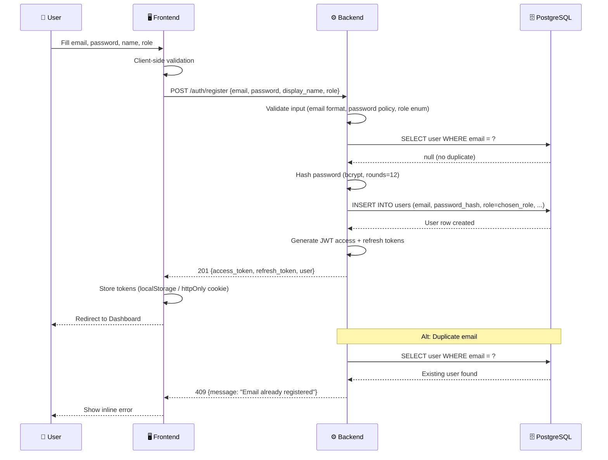
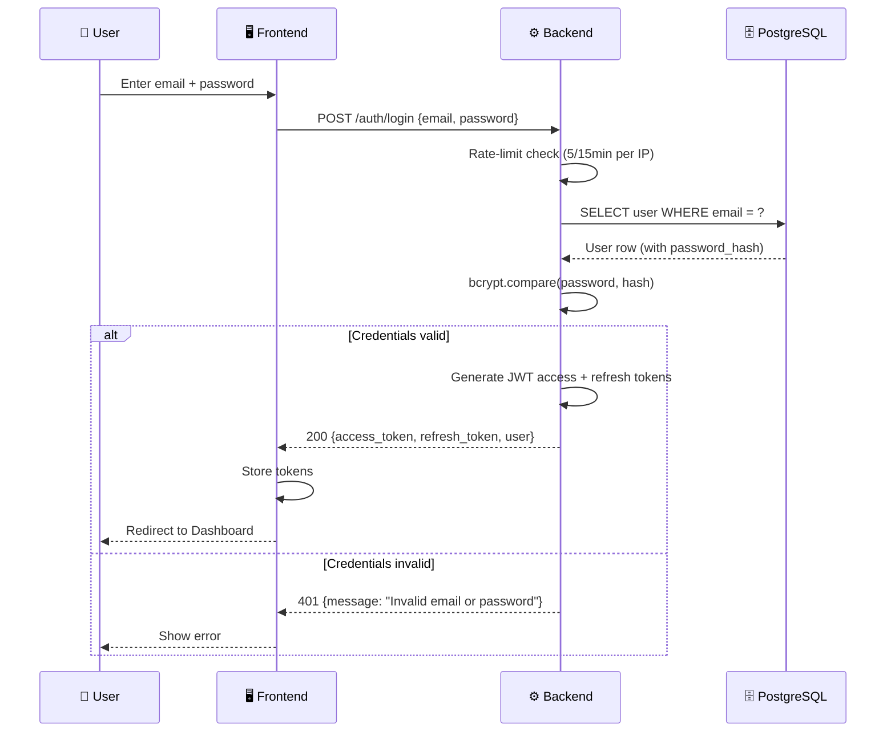
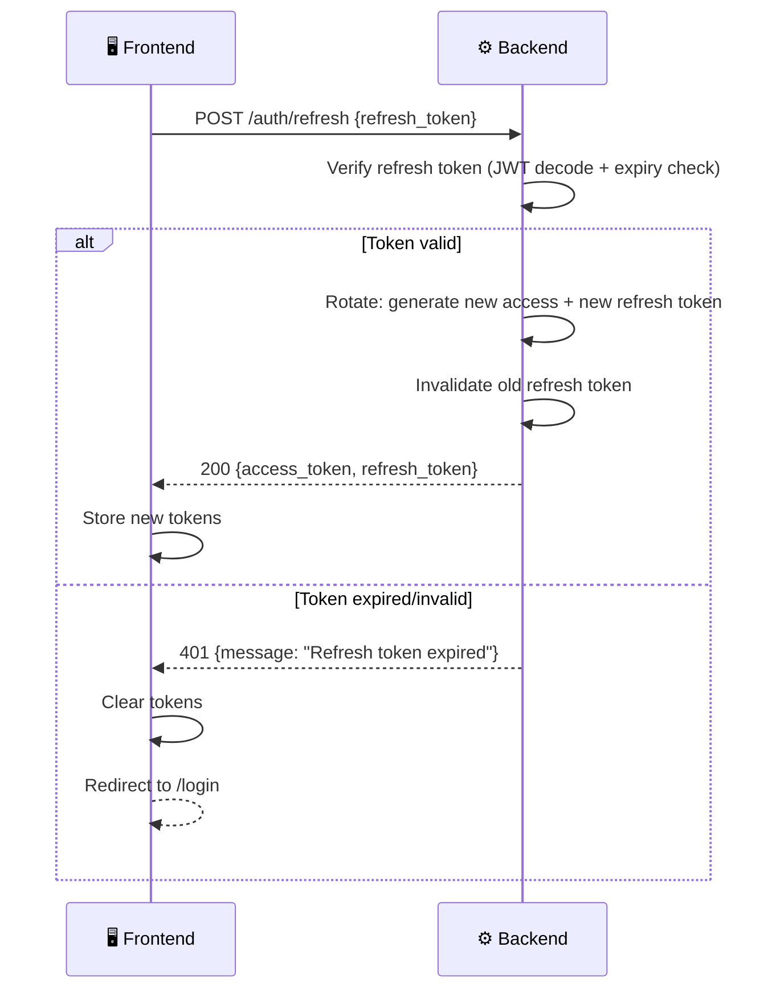
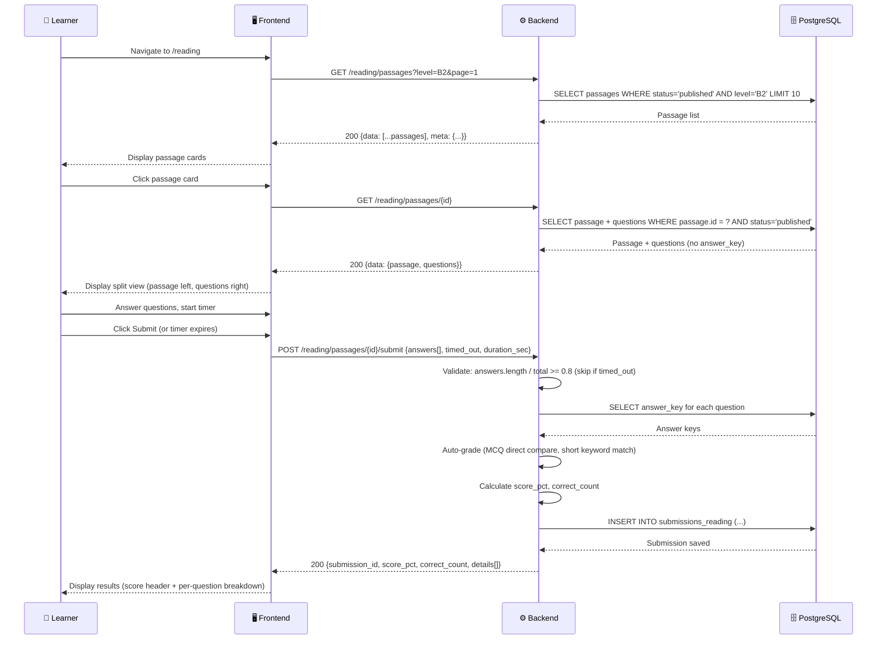
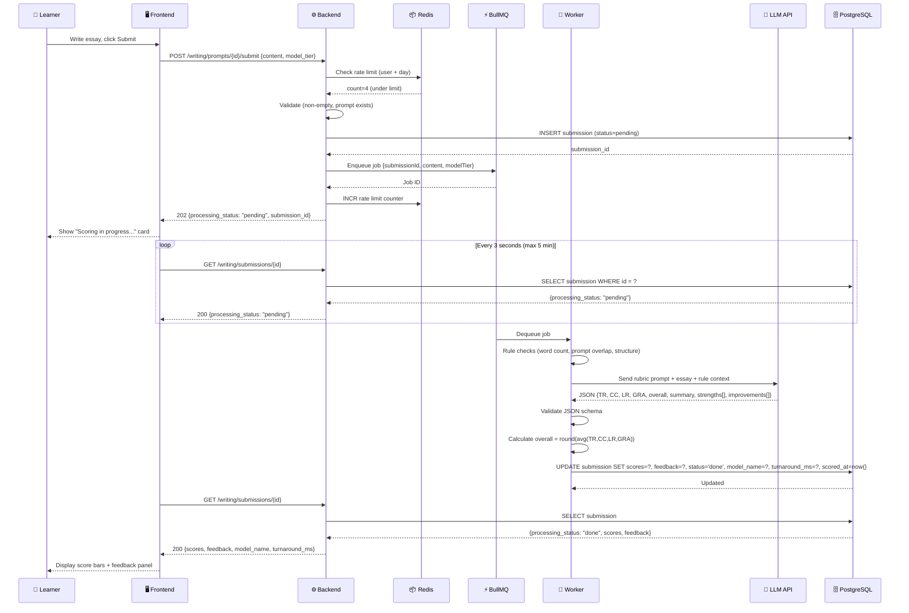
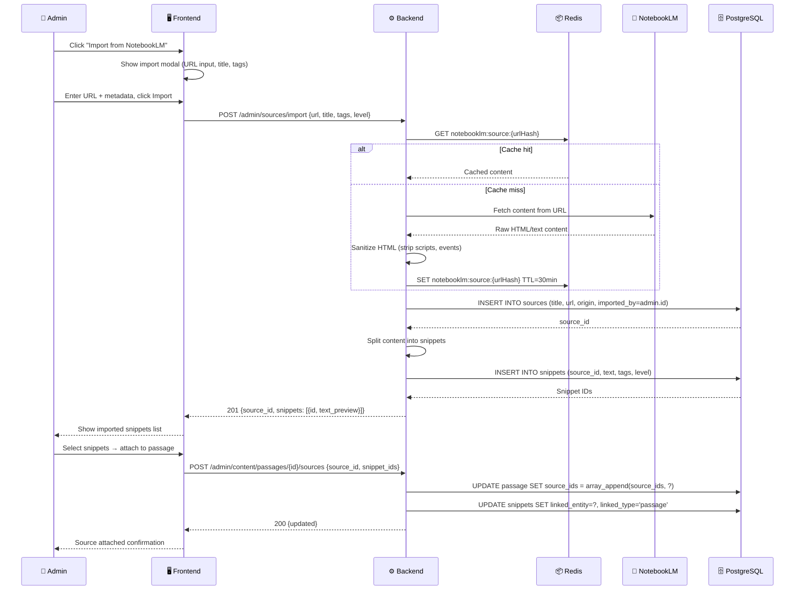
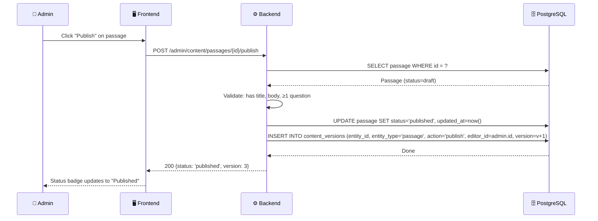

# 🔄 Sequence Diagrams — IELTS Helper (MVP)

> **Mã tài liệu:** PRD-15  
> **Phiên bản:** 1.0  
> **Ngày tạo:** 2025-02-21  
> **Trạng thái:** Draft  
> **Tham chiếu:** [05_functional_requirements](05_functional_requirements.md) | [09_api_specifications](09_api_specifications.md)

---

## SD-01: User Registration



---

## SD-02: User Login



---

## SD-03: Token Refresh



---

## SD-04: Reading Practice (Browse → Submit → Result)



---

## SD-05: Writing Submit — Async Scoring Pipeline



---

## SD-06: Writing Scoring Failure & Retry

```mermaid
sequenceDiagram
    participant Q as ⚡ BullMQ
    participant W as 🔧 Worker
    participant LLM as 🤖 LLM API
    participant DB as 🗄️ PostgreSQL
    participant DLQ as 💀 Dead Letter Queue

    Q->>W: Dequeue job (attempt 1)
    W->>LLM: Send scoring prompt
    LLM-->>W: ❌ Timeout (60s)
    W->>W: Log error; trigger retry

    Q->>W: Retry (attempt 2, after 1s backoff)
    W->>LLM: Send scoring prompt
    LLM-->>W: ❌ Invalid JSON response
    W->>W: Log error; trigger retry

    Q->>W: Retry (attempt 3, after 2s backoff)
    W->>LLM: Send scoring prompt
    LLM-->>W: ❌ 500 Server Error
    W->>W: Max retries exhausted

    W->>DB: UPDATE submission SET status='failed', error_message='Scoring service unavailable after 3 attempts'
    W->>DLQ: Move job to Dead Letter Queue
    
    Note over DLQ: Admin reviews failed jobs via /admin/queues
```

---

## SD-07: Admin Import from NotebookLM



---

## SD-08: Admin Publish Content



---

> **Tham chiếu:** [05_functional_requirements](05_functional_requirements.md) | [09_api_specifications](09_api_specifications.md) | [11_business_rules](11_business_rules.md)
