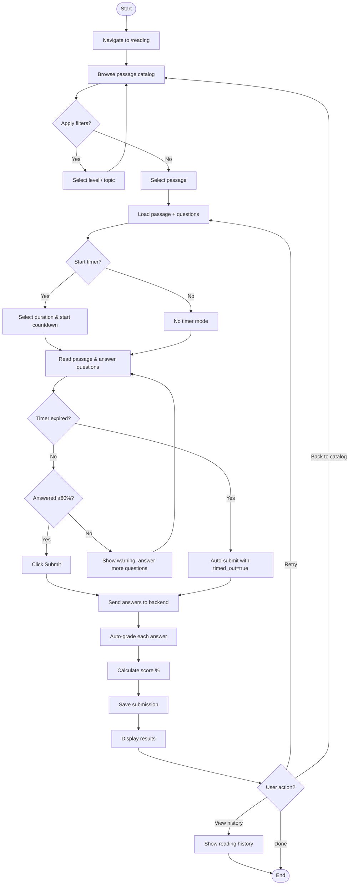
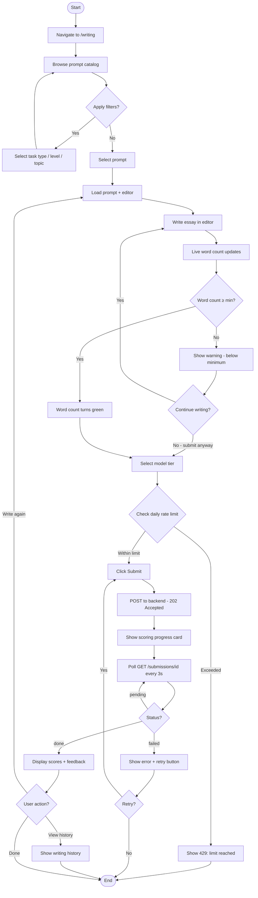
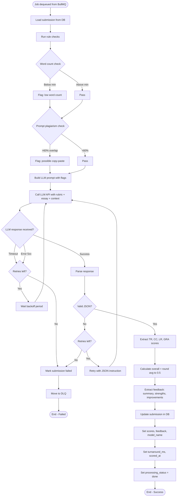
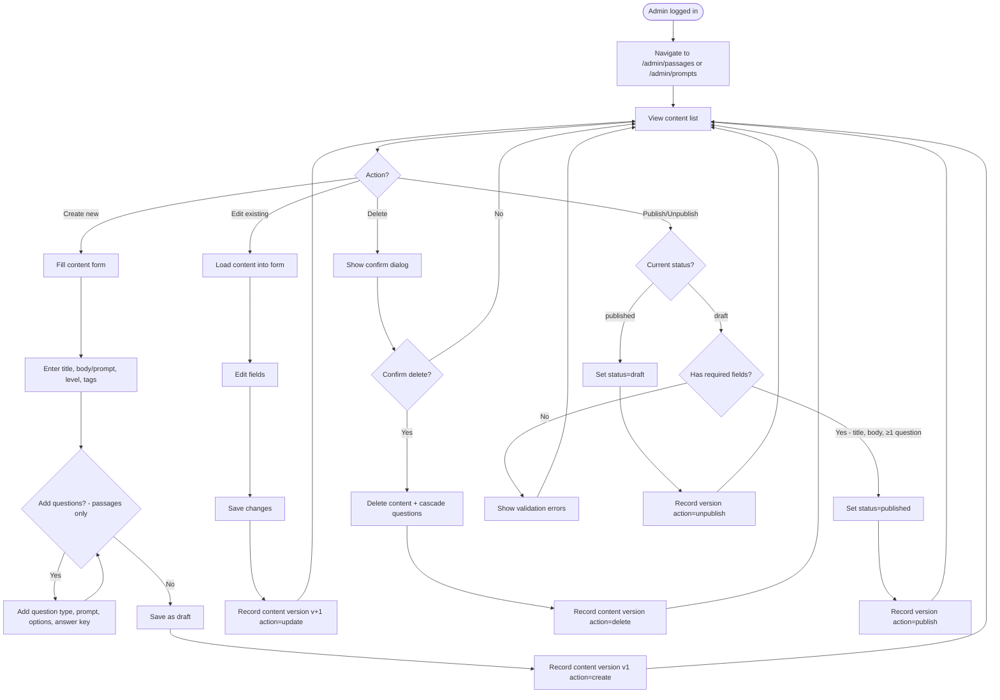
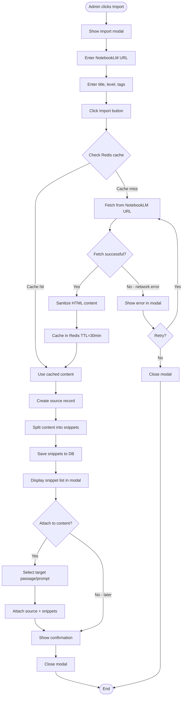
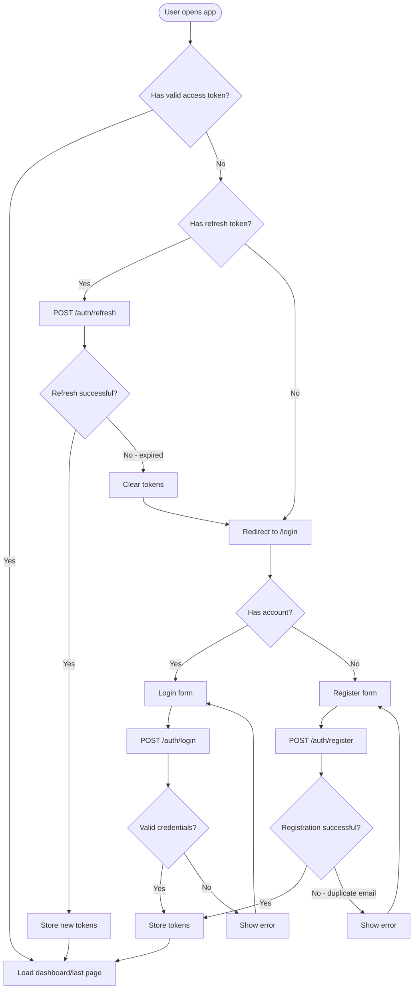
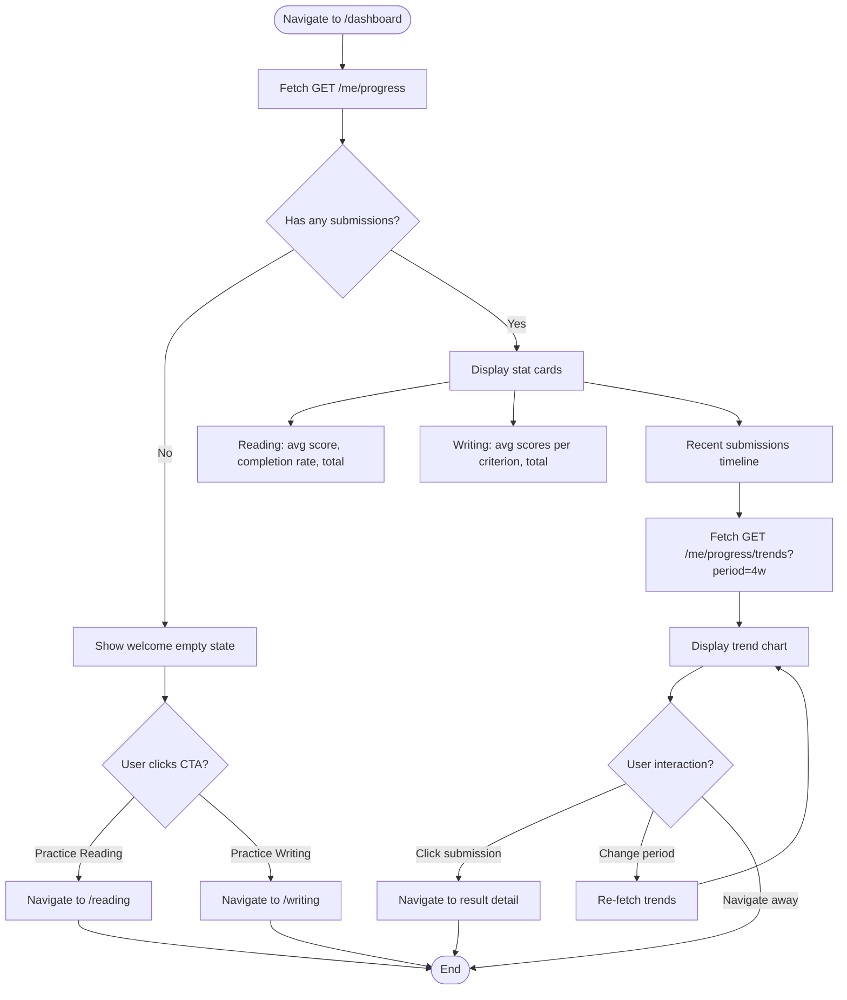

# 🔀 Activity Diagrams — IELTS Helper (MVP)

> **Mã tài liệu:** PRD-16  
> **Phiên bản:** 1.0  
> **Ngày tạo:** 2025-02-21  
> **Trạng thái:** Draft  
> **Tham chiếu:** [04_user_stories](04_user_stories.md) | [14_usecase_diagram](14_usecase_diagram.md)

---

## AD-01: Reading Practice Flow (Learner)

---

## AD-02: Writing Practice Flow (Learner)

---

## AD-03: Writing Scoring Pipeline (System)

---

## AD-04: Admin Content Publishing Flow

---

## AD-05: NotebookLM Import Flow

---

## AD-06: Authentication Flow

---

## AD-07: Dashboard View Flow

---

> **Tham chiếu:** [04_user_stories](04_user_stories.md) | [14_usecase_diagram](14_usecase_diagram.md) | [15_sequence_diagrams](15_sequence_diagrams.md)
