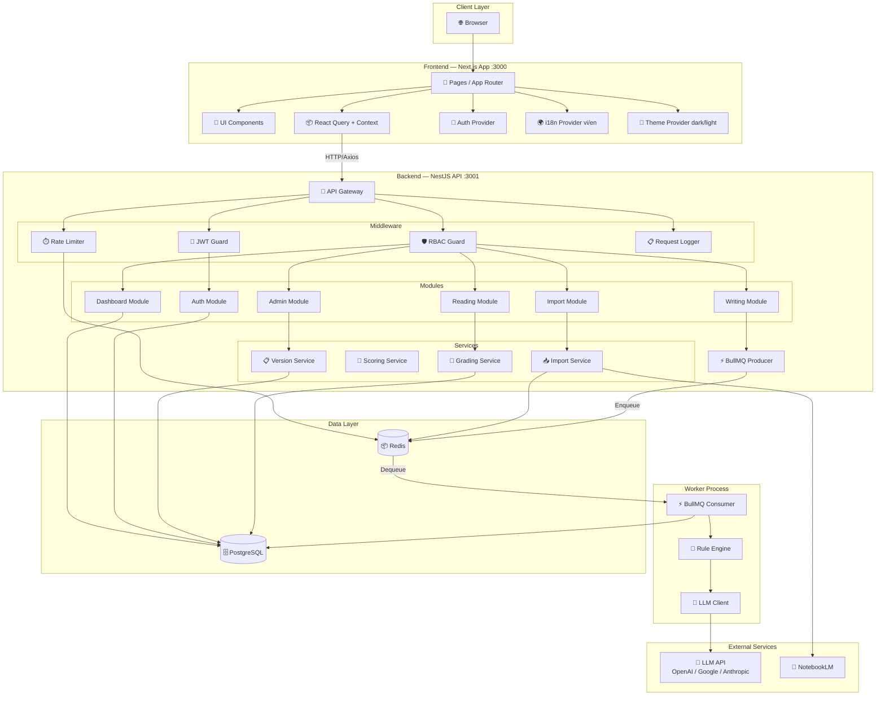

# 🏗️ Component Diagram — IELTS Helper (MVP)

> **Mã tài liệu:** PRD-17  
> **Phiên bản:** 1.0  
> **Ngày tạo:** 2025-02-21  
> **Trạng thái:** Draft  
> **Tham chiếu:** [12_technical_constraints](12_technical_constraints.md) | [15_sequence_diagrams](15_sequence_diagrams.md)

---

## 1. System Architecture Overview



---

## 2. Frontend Component Breakdown

```mermaid
graph TB
    subgraph "App Shell"
        Layout[RootLayout]
        Nav[Sidebar / BottomNav]
        Header[Header - logo, user menu, toggles]
    end

    subgraph "Auth Pages"
        LoginPage[/login]
        RegisterPage[/register]
    end

    subgraph "Reading Pages"
        ReadingList[/reading - Catalog]
        ReadingDetail[/reading/:id - Practice]
        ReadingResult[/reading/:id/result/:subId]
        ReadingHistory[/reading/history]
    end

    subgraph "Writing Pages"
        WritingList[/writing - Catalog]
        WritingEditor[/writing/:id - Editor]
        WritingFeedback[/writing/submissions/:id]
        WritingHistory[/writing/history]
    end

    subgraph "Dashboard Pages"
        DashboardMain[/dashboard]
    end

    subgraph "Admin Pages"
        AdminPassages[/admin/passages]
        AdminPassageForm[/admin/passages/new or :id]
        AdminPrompts[/admin/prompts]
        AdminPromptForm[/admin/prompts/new or :id]
        AdminSources[/admin/sources]
        AdminUsers[/admin/users]
    end

    subgraph "Shared Components"
        FilterBar[FilterBar - level, topic, search]
        PaginationC[Pagination]
        ScoreBar[ScoreBar - 0–9 with fill]
        Timer[Timer - countdown]
        WordCounter[WordCounter]
        Card[ContentCard]
        Badge[StatusBadge / LevelBadge]
        Modal[Modal - confirm, import]
        Toast[Toast - notifications]
        Skeleton[Skeleton - loading]
        EmptyState[EmptyState]
    end

    Layout --> Nav
    Layout --> Header
    ReadingList --> FilterBar
    ReadingList --> Card
    ReadingList --> PaginationC
    ReadingDetail --> Timer
    WritingEditor --> WordCounter
    WritingFeedback --> ScoreBar
    AdminPassages --> Modal
```

---

## 3. Backend Module Breakdown

```mermaid
graph TB
    subgraph "Auth Module"
        AuthController[AuthController]
        AuthService[AuthService]
        JwtStrategy[JwtStrategy]
        RolesGuard[RolesGuard]
    end

    subgraph "Reading Module"
        ReadingController[ReadingController]
        ReadingService[ReadingService]
        GradingService[GradingService]
    end

    subgraph "Writing Module"
        WritingController[WritingController]
        WritingService[WritingService]
        ScoringProducer[ScoringProducer - BullMQ]
    end

    subgraph "Scoring Worker - separate process"
        ScoringConsumer[ScoringConsumer]
        RuleEngine[RuleEngine]
        LLMClient[LLMClient]
        LLMAdapter[LLMAdapter - strategy pattern]
    end

    subgraph "Dashboard Module"
        DashboardController[DashboardController]
        ProgressService[ProgressService]
    end

    subgraph "Admin Module"
        AdminController[AdminController]
        ContentService[ContentService]
        VersionService[VersionService]
    end

    subgraph "Import Module"
        ImportController[ImportController]
        ImportService[ImportService]
        SanitizeUtil[SanitizeUtil]
    end

    subgraph "Shared"
        DB_Module[DatabaseModule - TypeORM/Prisma]
        Redis_Module[RedisModule]
        Config_Module[ConfigModule - env vars]
        Logger_Module[LoggerModule - Pino]
    end

    AuthController --> AuthService
    AuthService --> JwtStrategy
    ReadingController --> ReadingService
    ReadingService --> GradingService
    WritingController --> WritingService
    WritingService --> ScoringProducer
    ScoringConsumer --> RuleEngine
    ScoringConsumer --> LLMClient
    LLMClient --> LLMAdapter
    DashboardController --> ProgressService
    AdminController --> ContentService
    AdminController --> VersionService
    ImportController --> ImportService
    ImportService --> SanitizeUtil
```



---

## 4. Data Flow Summary

| Flow | Source | Destination | Protocol | Data |
|------|--------|-------------|----------|------|
| Browse content | FE | BE → PG | HTTP GET | Passage/prompt lists |
| Submit reading | FE | BE → PG | HTTP POST | Answers → score (sync) |
| Submit writing | FE | BE → Redis → Worker → PG | HTTP POST + Queue | Essay → scores (async) |
| Poll status | FE | BE → PG | HTTP GET | Submission status |
| Admin CRUD | FE | BE → PG | HTTP POST/PATCH/DELETE | Content mutations |
| Import source | FE | BE → NLM → Redis → PG | HTTP POST | URL → content → snippets |
| LLM scoring | Worker | LLM API | HTTPS | Rubric prompt → JSON scores |
| Rate limiting | BE | Redis | Redis commands | INCR/GET counters |
| Caching | BE | Redis | Redis commands | GET/SET with TTL |

---

## 5. Deployment Architecture (Local Dev)

```
┌─────────────────────────────────────────────────┐
│                 Developer Machine                │
│                                                  │
│  ┌──────────────┐    ┌──────────────┐           │
│  │  Next.js FE  │    │  NestJS BE   │           │
│  │   :3000      │───►│   :3001      │           │
│  └──────────────┘    └──────┬───────┘           │
│                             │                    │
│         ┌───────────────────┼───────────────┐   │
│         │                   │               │   │
│         ▼                   ▼               │   │
│  ┌────────────┐     ┌────────────┐          │   │
│  │ PostgreSQL  │     │   Redis    │          │   │
│  │  :5432      │     │   :6379    │          │   │
│  │ (Docker)    │     │  (Docker)  │          │   │
│  └────────────┘     └────────────┘          │   │
│                                              │   │
│  ┌─────────────────────────┐                │   │
│  │  BullMQ Worker Process  │────────────────┘   │
│  │  (same or separate)     │                    │
│  └─────────────────────────┘                    │
│                                                  │
│  ┌──────────────────────────────────────┐       │
│  │  VS Code Dev Tunnel (for sharing)    │       │
│  │  https://<id>.devtunnels.ms          │       │
│  └──────────────────────────────────────┘       │
└─────────────────────────────────────────────────┘
                    │
                    ▼
        ┌────────────────────┐
        │  External APIs     │
        │  - OpenAI/Google   │
        │  - NotebookLM      │
        └────────────────────┘
```

---

## 6. Technology Stack Map

| Component | Technology | Port | Container |
|-----------|-----------|------|-----------|
| Frontend | Next.js 14 + React 18 + TypeScript | 3000 | No (native) |
| Backend API | NestJS 10 + TypeScript | 3001 | No (native) |
| Worker | NestJS (standalone or same process) | — | No |
| Database | PostgreSQL 15 | 5432 | Yes (Docker) |
| Cache/Queue | Redis 7 | 6379 | Yes (Docker) |
| LLM | OpenAI / Google / Anthropic SDK | — | External API |
| NotebookLM | Google NotebookLM | — | External service |

---

> **Tham chiếu:** [12_technical_constraints](12_technical_constraints.md) | [09_api_specifications](09_api_specifications.md) | [08_data_requirements](08_data_requirements.md)
